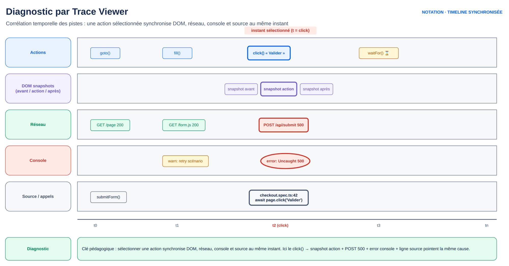

# M2.1 — Debug : Inspector, Codegen et Trace Viewer

## 1. Cours théorique

### 1.1 Pourquoi un module entier sur le debug ?

- Un test qui échoue pose toujours la même question : **bug de l'application, ou bug du test ?**
- Un automaticien passe plus de temps à comprendre des échecs qu'à écrire des tests.
- Quatre outils pour quatre situations :

| Situation | Outil |
|---|---|
| J'écris un test et je cherche le bon locator | **UI Mode** (`--ui`) ou l'extension VS Code |
| Mon test échoue en local, je veux le voir pas à pas | **Inspector** (`--debug`) |
| Je ne sais pas par où commencer sur une page inconnue | **Codegen** (`codegen`) |
| Mon test a échoué en CI cette nuit, sans moi | **Trace Viewer** (`show-trace`) |

### 1.2 Les messages d'erreur : première source d'information

Avant tout outil, lire l'erreur. Les messages sont structurés :

```
Error: expect(locator).toBeVisible() failed

Locator: getByRole('button', { name: 'Valider' })
Expected: visible
Received: <element(s) not found>
Timeout: 5000ms

Call log:
  - Expect "toBeVisible" with timeout 5000ms
  - waiting for getByRole('button', { name: 'Valider' })
```

À lire dans l'ordre : assertion, locator, attendu, obtenu, puis le **call log** des tentatives. Cas typiques :

- `<element(s) not found>` : aucun élément ne correspond. Faute de frappe, page pas encore chargée, mauvaise page.
- `resolved to 3 elements` : strict mode, affiner.
- `element is not visible` : élément présent mais masqué (onglet inactif, `display:none`).
- `element intercepts pointer events` : overlay, modale ou cookie banner sur la cible.
- `Test timeout of 30000ms exceeded` : une action a attendu jusqu'au bout. Lire la dernière ligne du call log.

Depuis la 1.51, chaque échec produit aussi `error-context.md` dans `test-results/` : instantané ARIA de la page au moment de l'échec, lisible aussi bien par un humain que par un outil d'analyse automatisée.

### 1.3 UI Mode

```powershell
npx playwright test --ui
```

Interface graphique : liste des tests, exécution, et pour chacun timeline, actions, DOM snapshot avant/après chaque action, console, réseau. Fonctions principales :

- **Watch** : relance le test à chaque sauvegarde du fichier.
- **Pick locator** : cliquer sur un élément de la page pour obtenir le locator recommandé.
- **Timeline** : survoler pour voir la page à cet instant.
- Filtres par projet, par statut, par tag.

Outil du quotidien pour écrire des tests. L'extension VS Code offre les mêmes fonctions dans l'éditeur (« Pick locator », « Record new », « Show browser »).

### 1.4 Playwright Inspector

```powershell
npx playwright test tests/login.spec.ts --debug
# ou un seul test
npx playwright test -g "connexion réussie" --debug
```

L'Inspector ouvre le navigateur en headed et une fenêtre de contrôle :

- **Step over** : action suivante. Le locator est surligné dans la page avant l'action.
- **Resume** : continue jusqu'au prochain `page.pause()` ou la fin.
- **Pick locator** : comme l'UI Mode.
- Onglet **Log** : vérifications d'actionnabilité en cours (« waiting for element to be visible »).

`await page.pause()` dans le code :

- Point d'arrêt : le test s'exécute normalement jusque-là, puis l'Inspector prend la main.
- Pratique pour atteindre vite la zone problématique.
- **Ne jamais committer un `page.pause()`** : ignoré en CI headless, mais signe d'un test non fini.

Variables d'environnement utiles :

```powershell
$env:PWDEBUG=1; npx playwright test          # équivaut à --debug
$env:DEBUG="pw:api"; npx playwright test     # log verbeux de chaque appel API
```

Debug VS Code classique : point d'arrêt dans le `.spec.ts`, clic droit sur le test dans l'explorateur de tests, « Debug test ». Inspection des variables et évaluation de `await page.locator(...).count()` dans la console de debug.

### 1.5 Codegen : enregistrer pour démarrer, pas pour livrer

```powershell
npx playwright codegen https://www.demoblaze.com
npx playwright codegen --target=typescript --output=tests/brouillon.spec.ts https://www.demoblaze.com
npx playwright codegen --viewport-size=1280,720 --device="iPhone 13" https://...
npx playwright codegen --save-storage=auth.json https://...   # enregistre cookies/localStorage
npx playwright codegen --load-storage=auth.json https://...
```

- Codegen ouvre un navigateur et une fenêtre qui écrit le code au fil des clics.
- Même priorité de locators qu'en M1.2 : rôle, puis label, placeholder, texte, test id, CSS.
- Mode **Assert** : cliquer sur un élément pour générer `toBeVisible`, `toHaveText`, `toHaveValue`.

**Ce que Codegen produit et pourquoi ce n'est pas livrable** :

```ts
test('test', async ({ page }) => {
  await page.goto('https://www.demoblaze.com/');
  await page.getByRole('link', { name: 'Samsung galaxy s6' }).click();
  await page.getByRole('link', { name: 'Add to cart' }).click();
  await page.getByRole('link', { name: 'Cart', exact: true }).click();
  await page.getByRole('button', { name: 'Place Order' }).click();
  await page.getByRole('textbox', { name: 'Name:' }).fill('Alice');
});
```

Problèmes :

- Pas de nom de test.
- Pas d'assertion (sauf mode Assert).
- URL en dur.
- Enchaînement linéaire sans structure.
- Des `click()` sur des éléments peut-être en cours d'animation.
- Données mélangées à la logique.
- Aucune gestion des dialogues (`alert`) ouverts par le site.

**Le refactoring en 6 étapes** que vous appliquerez :

1. Nommer le test par le comportement attendu.
2. Remplacer l'URL par `baseURL` + chemin.
3. Ajouter une assertion après chaque étape significative (l'effet visible).
4. Extraire les données (nom, produit) en constantes en tête de test.
5. Découper en `test.step()` pour un rapport lisible.
6. Vérifier chaque locator : `exact: true` là où Codegen l'a mis pour cause d'ambiguïté, remplacer un CSS par un rôle si possible.

`test.step` :

```ts
await test.step('Ajouter le produit au panier', async () => {
  await page.getByRole('link', { name: 'Add to cart' }).click();
});
```

Les étapes apparaissent dans le rapport HTML et dans la trace, avec leur durée. Elles documentent le scénario.

### 1.6 Trace Viewer : le debug après coup

Une **trace** est une archive `.zip` de tout ce qui s'est passé pendant un test :

- chaque action et ses paramètres ;
- un snapshot DOM avant et après ;
- les captures d'écran en continu (filmstrip) ;
- le réseau, la console, le code source, les métadonnées.

Rejouable sur n'importe quelle machine, sans l'application.

Configuration dans `playwright.config.ts` :

| Valeur | Comportement | Usage |
|---|---|---|
| `'off'` | Jamais | |
| `'on'` | Toujours | Lourd, debug local ponctuel |
| `'retain-on-failure'` | Enregistrée, conservée seulement si échec | **Recommandé en CI** |
| `'on-first-retry'` | Enregistrée seulement à la première relance | Défaut de `npm init`, économe |
| `'on-all-retries'` | À chaque relance | |

En ligne de commande : `npx playwright test --trace on`.

Ouverture :

```powershell
npx playwright show-trace test-results/login-connexion-chromium/trace.zip
# ou glisser le zip sur https://trace.playwright.dev (tout reste local dans le navigateur)
```

Le rapport HTML contient un lien direct vers la trace de chaque test échoué.

Lecture d'une trace :

1. **Actions** (gauche) : la liste et les durées. L'action rouge est celle qui a échoué.
2. **Snapshot** (centre) : le DOM au moment de l'action, onglets Before / Action / After. Cliquable pour inspecter, avec Pick locator.
3. **Timeline** (haut) : le film des captures.
4. **Onglets bas** : Call (paramètres et call log de l'action), Log, Errors, Console, Network, Source, Attachments.

Méthode pour un échec CI : ouvrir la trace, cliquer sur l'action rouge, lire le call log, regarder le snapshot Before, puis Network pour une requête échouée ou lente.



*Figure — Diagnostic par Trace Viewer : corréler une action à son effet réel (DOM, réseau, console, source) pour trouver la cause racine.*

### 1.7 Captures et vidéos

```ts
use: {
  screenshot: 'only-on-failure',   // 'off' | 'on' | 'only-on-failure'
  video: 'retain-on-failure',      // 'off' | 'on' | 'retain-on-failure' | 'on-first-retry'
}
```

- Vidéo rarement utile si la trace est activée : la trace contient déjà le filmstrip et bien plus.
- Recommandation : trace + screenshot, pas de vidéo, sauf demande d'une équipe non technique.
- Capture manuelle : `await page.screenshot({ path: 'etat.png', fullPage: true })`.
- Attacher au rapport : `await testInfo.attach('etat', { body: await page.screenshot(), contentType: 'image/png' })`.

### 1.8 Bonnes pratiques

1. Lire le message d'erreur en entier avant d'ouvrir un outil.
2. `trace: 'retain-on-failure'` en CI, `screenshot: 'only-on-failure'`.
3. Codegen pour explorer et découvrir les locators, jamais pour livrer sans refactoring.
4. `test.step` pour tout scénario de plus de 5 actions.
5. `page.pause()` en local seulement ; règle ESLint ou hook pre-commit.
6. Traces des échecs CI conservées comme artefacts (J5).
7. Un test qui échoue « parfois » se debugge avec la trace de l'échec, pas en relançant jusqu'au vert.

### 1.9 Erreurs fréquentes

| Erreur | Cause | Correction |
|---|---|---|
| `--debug` s'ouvre mais lance tous les tests | Pas de filtre | Ajouter le fichier ou `-g` |
| Aucune trace dans `test-results/` | `trace: 'on-first-retry'` sans retry configuré | `retain-on-failure` ou `--trace on` |
| Codegen génère `locator('#id')` pour tout | Le site n'a ni rôles ni labels | Demander des attributs aux devs, ou `data-testid` |
| Codegen a mis `exact: true` partout | Ambiguïtés de noms | Vérifier que le nom exact ne cassera pas au premier changement de libellé |
| `page.pause()` committé | Oubli | Règle lint, revue de code |
| Trace « ouverte » mais vide | Zip d'un test qui n'a pas démarré (erreur de compilation) | Regarder la sortie console |
| La vidéo est noire | Navigateur headless sans GPU | Utiliser la trace |

### 1.10 Points à retenir

- Erreur, puis UI Mode ou Inspector en local, Trace Viewer pour la CI.
- Codegen = brouillon. Le refactoring en 6 étapes en fait un test.
- `trace: 'retain-on-failure'` est le réglage à retenir pour la semaine.
- `test.step` structure le rapport et la trace.

---

## 2. Démonstration

**Objectif** : enregistrer un scénario d'achat sur Demoblaze avec Codegen, le refactorer, déclencher un échec, ouvrir la trace, diagnostiquer.

**Site** : https://www.demoblaze.com

### Étapes

1. `npx playwright codegen https://www.demoblaze.com --output=tests/brouillon.spec.ts`. Enchaîner : « Samsung galaxy s6 », « Add to cart » (alerte gérée par Codegen avec `page.once('dialog')`), menu « Cart », « Place Order », Name et Credit card, « Purchase », « OK ». Fermer Codegen.
2. Relire le brouillon ligne par ligne : ce qui est bon (les rôles), ce qui manque (assertions, nom, structure).
3. Écrire à côté la version refactorée (`tests/achat.spec.ts`, ci-dessous), les 6 étapes une par une.
4. Lancer en `--ui` : Watch, Pick locator, timeline.
5. Bug volontaire : « Place Order » remplacé par « Place order » avec `exact: true`. Lancer avec `--trace on`. Ouvrir le rapport, puis la trace.
6. Dans la trace : action rouge, call log, snapshot Before avec le bouton présent, Pick locator sur le bouton pour retrouver le bon nom. Onglet Network : appels à l'API du site.
7. Réparer. Relancer avec `--debug` et `-g "achat"` : trois Step over pour le surlignage, puis Resume.

### Code complet : brouillon typique produit par Codegen (`demo/tests/brouillon.spec.ts`)

```ts
import { test, expect } from '@playwright/test';

test('test', async ({ page }) => {
  await page.goto('https://www.demoblaze.com/');
  await page.getByRole('link', { name: 'Samsung galaxy s6' }).click();
  page.once('dialog', dialog => {
    console.log(`Dialog message: ${dialog.message()}`);
    dialog.dismiss().catch(() => {});
  });
  await page.getByRole('link', { name: 'Add to cart' }).click();
  await page.getByRole('link', { name: 'Cart', exact: true }).click();
  await page.getByRole('button', { name: 'Place Order' }).click();
  await page.getByRole('textbox', { name: 'Name:' }).fill('Alice');
  await page.getByRole('textbox', { name: 'Credit card:' }).fill('4111111111111111');
  await page.getByRole('button', { name: 'Purchase' }).click();
  await page.getByRole('button', { name: 'OK' }).click();
});
```

### Code complet : version refactorée (`demo/tests/achat.spec.ts`)

```ts
import { test, expect } from '@playwright/test';

const PRODUIT = 'Samsung galaxy s6';
const CLIENT = { nom: 'Alice Martin', carte: '4111111111111111' };

test('un visiteur peut acheter un produit et voir la confirmation', async ({ page }) => {
  await test.step('Ouvrir la fiche produit', async () => {
    await page.goto('/');
    await page.getByRole('link', { name: PRODUIT }).click();
    await expect(page.getByRole('heading', { name: PRODUIT })).toBeVisible();
  });

  await test.step('Ajouter au panier (le site confirme par une alerte)', async () => {
    // On accepte l'alerte ET on vérifie son message : c'est une assertion, pas un contournement
    const alerte = page.waitForEvent('dialog');
    await page.getByRole('link', { name: 'Add to cart' }).click();
    const dialog = await alerte;
    expect(dialog.message()).toContain('Product added');
    await dialog.accept();
  });

  await test.step('Vérifier le panier', async () => {
    await page.getByRole('link', { name: 'Cart', exact: true }).click();
    const ligne = page.getByRole('row').filter({ hasText: PRODUIT });
    await expect(ligne).toBeVisible();
    // Le montant est un titre <h3> séparé du libellé « Total » : on cible le montant lui-même
    await expect(page.getByRole('heading', { name: '360' })).toBeVisible();
  });

  await test.step('Passer la commande', async () => {
    await page.getByRole('button', { name: 'Place Order' }).click();
    await page.getByRole('textbox', { name: 'Name:' }).fill(CLIENT.nom);
    await page.getByRole('textbox', { name: 'Credit card:' }).fill(CLIENT.carte);
    await page.getByRole('button', { name: 'Purchase' }).click();
  });

  await test.step('Lire la confirmation', async () => {
    const confirmation = page.getByText('Thank you for your purchase!');
    await expect(confirmation).toBeVisible();
    await expect(page.getByText(`Name: ${CLIENT.nom}`)).toBeVisible();
    await page.getByRole('button', { name: 'OK' }).click();
    await expect(confirmation).toBeHidden();
  });
});
```

### Explication du code

- Données en constantes : changer de produit ne touche pas la logique.
- Dialogue natif : `waitForEvent('dialog')` **avant** le clic déclencheur, sinon l'événement est raté. Son message est vérifié : l'alerte fait partie du comportement attendu.
- `getByRole('link', { name: 'Cart', exact: true })` : `exact` posé par Codegen parce que « Add to cart » contient aussi « cart ». Conservé en connaissance de cause.
- Chaque `test.step` finit par une assertion : l'échec est localisable dans le rapport.
- Total du Samsung galaxy s6 : 360 sur le site. Un changement de prix fera échouer le test : c'est voulu.

### Résultat attendu

- Test refactoré vert en 6 à 8 secondes. Rapport : cinq étapes nommées avec leur durée.
- Après le bug volontaire : clic sur « Place order » en rouge avec `<element(s) not found>` ; snapshot Before : le bouton réel « Place Order ».

---

## 3. Exercice (30 minutes)

Voir `exercice.md`. Le matériel de départ (test cassé et brouillon Codegen) est dans `exercice-materiel/`.

## 4. Correction

Voir `correction/`.

## 5. Contribution au projet fil rouge

**Ce qui est ajouté** : config de la mini-banque avec `trace: 'retain-on-failure'` et `screenshot: 'only-on-failure'` dès le premier jour. `test.step` dans les 6 tests du fil rouge J1 pour les scénarios de plus de trois actions (login MFA notamment).

**Lien avec la notion** : Codegen sur la mini-banque pour découvrir les locators de l'écran de login, puis les 6 étapes de refactoring. Fin de séance : diagnostic d'un échec par la trace.

## Ressources externes

- Debug : https://playwright.dev/docs/debug
- UI Mode : https://playwright.dev/docs/test-ui-mode
- Codegen : https://playwright.dev/docs/codegen
- Trace Viewer : https://playwright.dev/docs/trace-viewer
- Trace Viewer en ligne : https://trace.playwright.dev
- Dialogs : https://playwright.dev/docs/dialogs
- `test.step` : https://playwright.dev/docs/api/class-test#test-step
