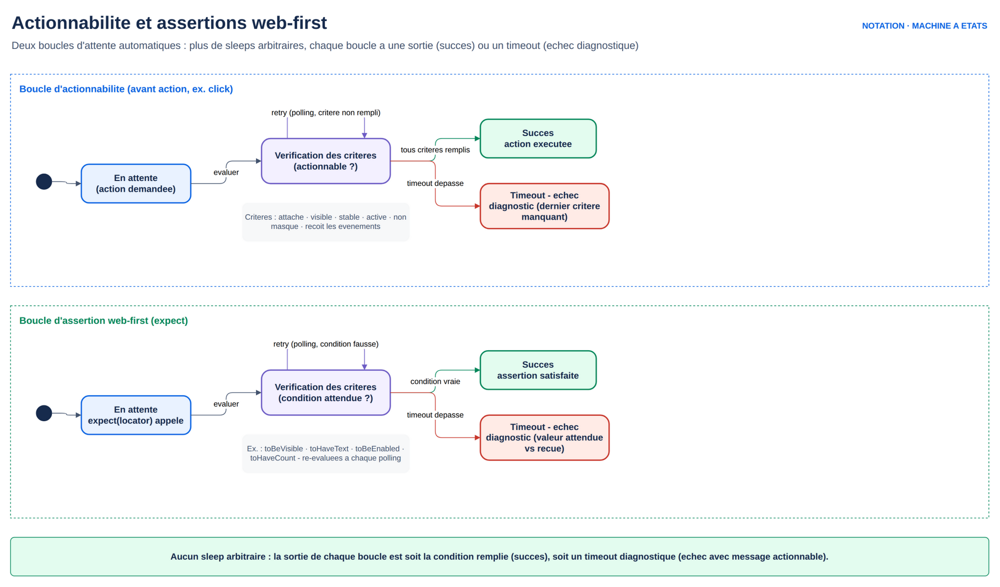

# M2.2 — Frames, Shadow DOM, screenshots et anti-flaky

## 1. Cours théorique

### 1.1 Les iframes

- `<iframe>` : un document HTML complet embarqué dans une page. Widget de paiement, éditeur de texte riche, vidéo, chat support, bannière de consentement.
- Pour Playwright, c'est un **document séparé** : `page.getByRole(...)` ne voit pas à l'intérieur.

Deux API :

| API | Usage |
|---|---|
| `page.frameLocator(sel)` | **Recommandé.** Retourne un `FrameLocator` sur lequel on utilise les mêmes `getByRole`, `getByText`... Auto-wait et strictness préservés. |
| `page.frame({ name })` / `page.frames()` | Retourne un objet `Frame`. Utile pour lister, écouter la navigation, ou pour du legacy. Pas d'attente automatique de l'apparition de la frame. |

```ts
// L'iframe est ciblée par un sélecteur sur l'élément <iframe> de la page parente
const editeur = page.frameLocator('iframe[title="Éditeur"]');
await editeur.getByRole('textbox').fill('Bonjour');
await expect(editeur.getByText('Bonjour')).toBeVisible();

// Alternative : depuis un locator
const editeur2 = page.locator('#mce_0_ifr').contentFrame();
```

- Depuis la 1.43, `locator.contentFrame()` convertit un `Locator` d'iframe en `FrameLocator` ; `frameLocator.owner()` fait l'inverse.
- Forme la plus lisible quand l'iframe a un rôle ou un titre : `page.getByTitle('Éditeur').contentFrame()`.

**Frames imbriquées** : chaîner les `frameLocator`.

```ts
const gauche = page.frameLocator('frame[name="frame-top"]').frameLocator('frame[name="frame-left"]');
await expect(gauche.getByText('LEFT')).toBeVisible();
```

Points d'attention :

- Iframe **cross-origin** (domaine différent) : accessible avec Chromium et Firefox ; restrictions avec WebKit. Paiement 3DS : souvent testé en mode sandbox du prestataire.
- Iframe qui se recharge (`src` change) : retrouvée automatiquement par `frameLocator` à la prochaine action.
- Identifier l'iframe par `title`, `name`, `id`, ou `src` (`iframe[src*="stripe"]`). Pas de `nth()` sur des iframes de pub qui bougent.

### 1.2 Le Shadow DOM

- **Shadow DOM** : un composant web (Web Component, `<my-widget>`) encapsule son HTML et son CSS. Ses nœuds internes sont invisibles pour `document.querySelector` de la page.
- Présent dans les design systems (Salesforce Lightning, Ionic, Shoelace, Adobe Spectrum), les widgets tiers, et de plus en plus d'applications d'entreprise.
- **Tous les locators Playwright traversent le Shadow DOM par défaut.** `getByRole`, `getByText`, `getByTestId` et les sélecteurs CSS via `locator()` percent les shadow roots **ouverts**.

```ts
// <my-card> #shadow-root <button>Valider</button>
await page.getByRole('button', { name: 'Valider' }).click();   // fonctionne
await page.locator('my-card button').click();                   // fonctionne aussi
```

Limites :

- Shadow roots **fermés** (`attachShadow({ mode: 'closed' })`) : inaccessibles, pour tout le monde. Rare en pratique.
- XPath ne traverse **pas** le Shadow DOM. Raison de plus pour l'éviter.
- `page.$eval` et `page.evaluate` avec `document.querySelector` ne traversent pas non plus : rester sur les locators.

Venant de Selenium : plus de `getShadowRoot()` ni de JavaScript injecté.

### 1.3 Screenshots et masquage des données personnelles

Trois usages de la capture d'écran :

1. **Preuve d'échec** : `screenshot: 'only-on-failure'` dans la config (vu en M2.1).
2. **Pièce jointe volontaire** : documenter un état dans le rapport.
3. **Comparaison visuelle** : `toHaveScreenshot()`, objet du M6.1.

```ts
await page.screenshot({ path: 'page.png' });
await page.screenshot({ path: 'page.png', fullPage: true });
await page.getByTestId('recapitulatif').screenshot({ path: 'recap.png' });   // un élément
await page.screenshot({ path: 'page.png', clip: { x: 0, y: 0, width: 800, height: 600 } });
```

**Masquage des données personnelles (PII)** :

- Rapports et traces sont partagés, archivés en CI, parfois envoyés à un prestataire.
- IBAN, nom, adresse e-mail : jamais en clair.
- Option `mask` : recouvre les éléments désignés d'un rectangle de couleur.

```ts
await page.screenshot({
  path: 'virement.png',
  mask: [page.getByTestId('iban'), page.getByLabel('Adresse e-mail')],
  maskColor: '#FF00FF',   // par défaut rose, pour être repérable
});
```

- Même option pour `toHaveScreenshot({ mask: [...] })`.
- Pas de masquage dans la trace : sur des données réelles, données de test synthétiques (M5.2) et politique de rétention des artefacts (J5).

Attacher une capture au rapport :

```ts
test('exemple', async ({ page }, testInfo) => {
  await testInfo.attach('récapitulatif', {
    body: await page.screenshot({ mask: [page.getByTestId('iban')] }),
    contentType: 'image/png',
  });
});
```

### 1.4 Les 5 règles anti-flaky

- Test **flaky** : échoue puis réussit sans changement de code.
- Il détruit la confiance dans la suite : en quelques semaines, l'équipe relance les builds rouges sans regarder.
- Presque toutes les causes tiennent dans les cinq règles suivantes.
- Le socle commun : Playwright attend automatiquement, via deux boucles de polling, avant chaque action et lors de chaque assertion web-first — jamais un délai fixe.



*Figure — Actionnabilité et assertions web-first : deux boucles de polling qui suppriment le besoin de sleep arbitraire.*

#### Règle 1 — Ne jamais attendre un temps fixe, attendre un état

```ts
// Interdit
await page.waitForTimeout(3000);
// Correct : attendre l'effet observable
await expect(page.getByRole('alert')).toHaveText('Virement effectué');
// Pour une navigation ou une réponse réseau précise
await page.waitForURL('**/dashboard');
const reponse = page.waitForResponse(r => r.url().includes('/api/accounts') && r.ok());
await page.getByRole('button', { name: 'Rafraîchir' }).click();
await reponse;
```

`waitForLoadState('networkidle')` est déconseillé par la documentation : avec du polling ou des websockets, il n'arrive jamais ou trop tôt. Attendre un élément est toujours plus précis.

#### Règle 2 — Un test = un contexte, aucune dépendance entre tests

- Chaque test crée ses données ou part d'un état connu.
- Aucun test ne suppose qu'un autre a tourné avant : avec `fullyParallel` et les shards de CI, l'ordre n'est pas garanti.
- Signaux d'alarme : `test.describe.configure({ mode: 'serial' })` pour enchaîner des tests, variables partagées au niveau du module, compteurs incrémentés.
- État coûteux (connexion) : partagé par `storageState` (M5.2), pas par l'ordre d'exécution.

#### Règle 3 — Assertions web-first, jamais de lecture immédiate

Vu en M1.2. `expect(await locator.textContent()).toBe(...)` est la source numéro 1 de flakiness sur React : la valeur est lue avant le re-rendu.

#### Règle 4 — Des locators stables et uniques

- `nth(2)` sur une liste triée par date, texte qui change avec la langue, classe CSS générée par un framework (`css-1x2y3z`) : autant de tests qui cassent sans régression de l'application.
- Priorité rôle > label > texte > test id, et `filter({ hasText })` plutôt que la position.

#### Règle 5 — Isoler le test de l'extérieur

Horloge, hasard, réseau tiers, données partagées :

- **Horloge** : `await page.clock.install({ time: new Date('2026-09-02T10:00:00') })` fige la date côté navigateur (M5, tests de délais et d'affichage de dates).
- **Hasard** : Faker avec une graine (`faker.seed(42)`).
- **Réseau tiers** : mocker les appels externes (`page.route`, M4.2) : analytics, cartes, paiement.
- **Données** : un utilisateur de test par worker, ou création via l'API avant le test.
- **Viewport** : taille fixée dans la config, pour éviter les layouts responsive différents entre postes.

Si malgré tout un test reste flaky :

- `retries` en CI est un filet, pas une solution. Le rapport marque le test « flaky » : KPI à suivre (M10.1).
- `test.fixme()` retire le test de la suite avec une raison, plutôt que de le laisser polluer.
- Analyser la trace de l'échec, pas celle du succès.

### 1.5 Tags et sélection de tests

- Les tags permettent de lancer un sous-ensemble : smoke, regression, slow, un module métier.
- Depuis la 1.42, les tags sont une option de `test` (l'ancienne convention `@tag` dans le titre fonctionne encore).

```ts
test('connexion nominale', { tag: '@smoke' }, async ({ page }) => { ... });
test('export PDF', { tag: ['@slow', '@regression'] }, async ({ page }) => { ... });
test.describe('Virements', { tag: '@virement' }, () => { ... });
```

Sélection :

```powershell
npx playwright test --grep @smoke
npx playwright test --grep "@smoke|@virement"
npx playwright test --grep-invert @slow
npx playwright test --grep "(?=.*@smoke)(?=.*@virement)"   # ET logique
```

- Dans la config, `grep` et `grepInvert` s'appliquent par projet : un projet `smoke` avec `grep: /@smoke/` et un projet `full`.
- Le rapport HTML filtre par tag.

Annotations complémentaires :

- `test.skip(condition, raison)`.
- `test.fixme()`.
- `test.slow()` : triple le timeout.
- `test.fail()` : le test doit échouer, utile pour documenter un bug connu.
- `annotation: { type: 'issue', description: 'JIRA-123' }` : lien vers le ticket, visible dans le rapport.

### 1.6 Bonnes pratiques

1. `frameLocator` ou `contentFrame()` avec un sélecteur stable sur l'iframe (`title`, `name`).
2. Pas de code spécifique au Shadow DOM : les locators standard suffisent.
3. Masquer les PII dans toute capture attachée ou comparée ; données synthétiques partout ailleurs.
4. Zéro `waitForTimeout` dans le dépôt : règle ESLint `playwright/no-wait-for-timeout` (plugin `eslint-plugin-playwright`).
5. Tag `@smoke` sur les 5 à 10 tests critiques dès le premier jour, pour un retour rapide en PR (J5).
6. Chaque test flaky reçoit un ticket et un `fixme` avec sa référence, dans la journée.

### 1.7 Erreurs fréquentes

| Erreur | Cause | Correction |
|---|---|---|
| `getByRole` ne trouve pas un bouton pourtant visible | Il est dans une iframe | `frameLocator(...)` |
| `frameLocator('iframe')` : strict mode violation | Plusieurs iframes (pubs, analytics) | Sélecteur par `title` ou `name` |
| Le test passe en local, échoue en CI sur une iframe | Chargement plus lent, `page.frame()` sans attente | `frameLocator` (auto-wait) |
| `locator('xpath=//my-card//button')` ne trouve rien | XPath ne traverse pas le Shadow DOM | CSS ou `getByRole` |
| Screenshot avec un IBAN en clair dans le rapport CI | Pas de masque | `mask: [...]` |
| Test vert seul, rouge dans la suite | Dépendance à un autre test | Données propres par test |
| `--grep smoke` ne sélectionne rien | Tag sans `@` | `--grep @smoke` |

### 1.8 Points à retenir

- Iframe : `frameLocator` ou `contentFrame()`, chaînables pour l'imbrication.
- Shadow DOM : transparent pour les locators, sauf XPath et shadow fermé.
- Screenshots : `mask` pour les données personnelles, `testInfo.attach` pour le rapport.
- 5 règles : attendre un état, isoler chaque test, assertions web-first, locators stables, contrôler l'extérieur.
- Tags : `{ tag: '@smoke' }` et `--grep`.

---

## 2. Démonstration

**Objectif** : iframe simple (The Internet), site complet embarqué (RahulShettyAcademy), frames imbriquées, Shadow DOM ; capture masquée attachée au rapport ; sélection par tag.

**Sites** : https://the-internet.herokuapp.com et https://rahulshettyacademy.com/AutomationPractice/

### Étapes

1. `/iframe` : dans les DevTools, l'éditeur est dans `<iframe title="Rich Text Area...">`. Décommenter la ligne « échec pédagogique » : `page.getByText` ne trouve rien. Corriger avec `contentFrame()`. L'éditeur est en lecture seule sur ce site (`contenteditable="false"`) : le test le constate par un attribut.
2. Page RahulShettyAcademy, défiler jusqu'à l'iframe qui embarque un site entier. `getByRole` fonctionne dedans comme sur une page ; le même locator sur `page` retourne 0 élément.
3. `/nested_frames` : hiérarchie `frame-top > frame-left / middle / right`, écrire le chaînage.
4. `/shadowdom` : inspecter le `#shadow-root (open)`. Lancer le test. Sans le `getByRole('list')` : `strict mode violation`, deux éléments portent le même texte. Conclusion : les locators traversent le shadow DOM sans API spéciale ; on affine avec `filter`/un conteneur comme pour tout autre doublon.
5. `/login`, après connexion : capture masquant le message flash, attachée au rapport. Ouvrir le rapport : pièce jointe avec le rectangle rose.
6. `npx playwright test --grep @smoke` puis `--grep-invert @smoke` : comparer le nombre de tests.

### Code complet : `demo/tests/frames-shadow.spec.ts`

Voir le fichier `demo/tests/frames-shadow.spec.ts` (5 tests). Extraits commentés :

```ts
// 1. iframe simple : contentFrame() depuis un locator sur l'élément <iframe>
const editeur = page.getByTitle('Rich Text Area').contentFrame();
await expect(editeur.getByText('Your content goes here.')).toBeVisible();

// 2. site embarqué : identifier l'iframe par son name, puis rôles à l'intérieur
const site = page.frameLocator('iframe[name="iframe-name"]');
await expect(site.getByRole('link', { name: 'JOIN NOW' })).toHaveCount(2);
await expect(page.getByRole('link', { name: 'JOIN NOW' })).toHaveCount(0);

// 3. imbrication : chaîner
const haut = page.frameLocator('frame[name="frame-top"]');
await expect(haut.frameLocator('frame[name="frame-left"]').getByText('LEFT')).toBeVisible();

// 4. shadow DOM : rien de spécial, les locators traversent le shadow root
await expect(page.getByText("Let's have some different text!")).toHaveCount(2);
await expect(page.getByRole('list').getByText("Let's have some different text!")).toBeVisible();

// 5. capture masquée
const capture = await page.screenshot({ mask: [page.locator('#flash')], maskColor: '#FF00FF' });
await testInfo.attach('zone sécurisée', { body: capture, contentType: 'image/png' });
```

### Explication du code

- `getByTitle(...).contentFrame()` : iframe ciblée par un attribut lisible, puis bascule à l'intérieur. `frameLocator('iframe[name=...]')` est équivalent depuis un sélecteur.
- `toHaveCount(0)` sur la page parente démontre l'isolation des documents.
- `/shadowdom` : le texte existe deux fois, une fois par composant. Le locator strict le signale ; on restreint à la liste, qui les contient, exactement comme pour tout autre doublon sur une page normale.
- `#flash` en CSS : ni rôle ni label ; niveau 6 justifié pour un masque.
- `testInfo` : second paramètre de la fonction de test. `attach` ajoute la capture au rapport HTML et à la trace.

### Résultat attendu

5 tests verts. `--grep @smoke` en lance 2. Dans le rapport, le test de capture montre une image avec un rectangle rose à la place du message.

---

## 3. Exercice (25 minutes)

Voir `exercice.md`.

## 4. Correction

Voir `correction/`.

## 5. Contribution au projet fil rouge

**Ce qui est ajouté dans la mini-banque** (séance fil rouge) :

- Un **Web Component** `<bank-balance>` à Shadow DOM ouvert : le solde sur le tableau de bord. Justification métier : widget partagé avec d'autres applications de la banque.
- Une **iframe** « Aide et conditions » sur la page de virement, servie par le backend sur `/legal`, avec la case « J'accepte les conditions » obligatoire avant validation.
- `data-testid="iban"` sur l'affichage de l'IBAN, pour le masquage.

**Tests Playwright du fil rouge J1 concernés** : « le solde s'affiche dans le composant shadow DOM » et « le virement exige l'acceptation dans l'iframe ». Le test de login MFA sera tagué `@smoke`.

**Lien avec la notion** : rien d'artificiel, toute application bancaire en contient (widgets partagés, contenus légaux embarqués). Vous appliquez `contentFrame()` et constatez la transparence du Shadow DOM sur votre propre application.

## Ressources externes

- Frames : https://playwright.dev/docs/frames
- Autres locators (shadow DOM, CSS) : https://playwright.dev/docs/other-locators
- Screenshots : https://playwright.dev/docs/screenshots
- Attachments : https://playwright.dev/docs/api/class-testinfo#test-info-attach
- Bonnes pratiques et flakiness : https://playwright.dev/docs/best-practices
- Clock : https://playwright.dev/docs/clock
- Tags et annotations : https://playwright.dev/docs/test-annotations
- ESLint plugin Playwright : https://github.com/playwright-community/eslint-plugin-playwright
