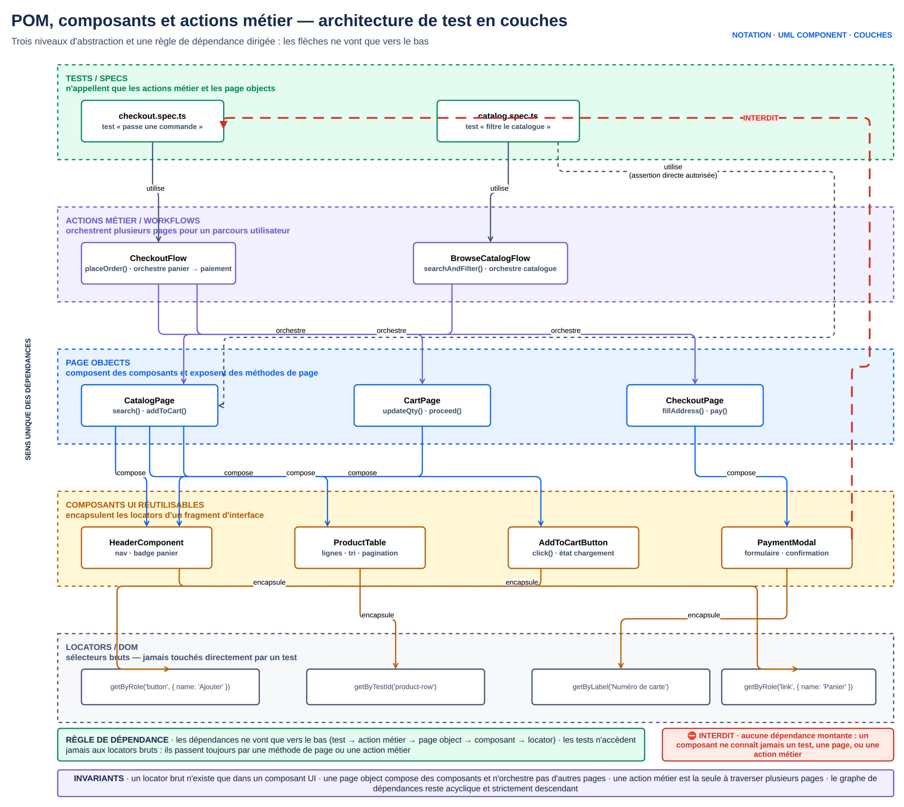

# M3.1 — Arborescence de projet et Page Object Model de base

## 1. Cours théorique

### 1.1 Le problème que résout le POM

- Jour 1 : la connexion SauceDemo (3 lignes de `fill` et `click`) est copiée dans chaque fichier.
- « Username » devient « Email » : 10 tests à modifier. Étape MFA ajoutée : 10 de plus.
- C'est le **couplage entre les tests et la structure de la page**.

Le **Page Object Model** (POM) : une classe par page (ou composant), qui expose :

- des **locators** (où sont les éléments),
- des **actions** (`login()`, `addToCart(produit)`),
- éventuellement des **lectures** (`getTotal()`).

Les tests n'utilisent que ces méthodes : ils décrivent le scénario métier, la classe cache le HTML.

```
Test :     "Alice se connecte et ajoute un sac au panier, le badge affiche 1"
             |                  |                            |
             v                  v                            v
Page Objects : LoginPage.login()  InventoryPage.addToCart()  InventoryPage.cartBadge
             |                  |                            |
             v                  v                            v
HTML :     getByLabel/fill    getByTestId(...).filter(...)  getByTestId('shopping-cart-badge')
```



*Figure — POM par composants : trois niveaux d'abstraction et une règle de dépendance descendante qui garantit la maintenabilité.*

Bénéfices :

- un seul endroit à modifier quand l'interface change ;
- tests lisibles par un non-développeur ;
- réutilisation entre tests ;
- revue de code plus simple (J5).

Ce que le POM **n'est pas** : un lieu pour les assertions métier complexes ou la logique de test. Le Page Object dit « comment », le test dit « quoi » et « vérifie ».

### 1.2 Arborescence de projet recommandée

```
projet-tests/
├── package.json
├── playwright.config.ts
├── .env.example                # variables : BASE_URL, API_URL, identifiants (jamais de vraies valeurs)
├── .gitignore                  # node_modules, test-results, playwright-report, .env, .auth
├── tests/                      # UN fichier .spec.ts par fonctionnalité
│   ├── auth/
│   │   ├── login.spec.ts
│   │   └── logout.spec.ts
│   ├── cart/
│   │   └── checkout.spec.ts
│   └── api/
│       └── users.api.spec.ts
├── pages/                      # Page Objects : une classe par page/composant
│   ├── LoginPage.ts
│   ├── InventoryPage.ts
│   ├── components/
│   │   └── HeaderComponent.ts
│   └── index.ts                # ré-exporte tout
├── fixtures/                   # fixtures personnalisées (hors périmètre du programme, voir doc Playwright)
│   └── test.ts
├── data/                       # jeux de données (JSON, CSV) (M5)
│   └── users.json
├── utils/                      # helpers techniques : formatage, dates, API client
│   └── api-client.ts
└── .auth/                      # storageState générés (M5.2), ignoré par git
```

Conventions :

- Test : `<fonctionnalite>.spec.ts`. Page Object : `<Nom>Page.ts` en PascalCase, classe du même nom.
- **Jamais** de `page.getByRole` direct dans un test si un Page Object existe pour la page. Exception : tests d'exploration ou de smoke très simples.
- Données (identifiants, produits) dans `data/` ou en constantes en tête de fichier, jamais en dur dans une action.
- `playwright.config.ts` à la racine, `testDir: './tests'`.

### 1.3 Anatomie d'un Page Object

```ts
// pages/LoginPage.ts
import { type Locator, type Page, expect } from '@playwright/test';

export class LoginPage {
  // 1. Locators déclarés comme propriétés readonly, initialisés dans le constructeur
  readonly usernameInput: Locator;
  readonly passwordInput: Locator;
  readonly loginButton: Locator;
  readonly errorMessage: Locator;

  constructor(private readonly page: Page) {
    this.usernameInput = page.getByPlaceholder('Username');
    this.passwordInput = page.getByPlaceholder('Password');
    this.loginButton = page.getByRole('button', { name: 'Login' });
    this.errorMessage = page.getByTestId('error');
  }

  // 2. Navigation
  async goto() {
    await this.page.goto('/');
  }

  // 3. Actions : verbes métier, paramètres explicites
  async login(username: string, password: string) {
    await this.usernameInput.fill(username);
    await this.passwordInput.fill(password);
    await this.loginButton.click();
  }

  // 4. Optionnel : une assertion "d'état de page" réutilisable
  async expectError(message: string | RegExp) {
    await expect(this.errorMessage).toContainText(message);
  }
}
```

Points de conception :

- Locators créés dans le constructeur : **paresseux** (M1.2), aucune recherche à la construction. Le Page Object peut être instancié avant l'affichage de la page.
- `private readonly page: Page` dans le constructeur : raccourci TypeScript, la page est stockée sans déclaration séparée.
- Locators `readonly` et **publics** : le test écrit `await expect(loginPage.errorMessage).toBeVisible()`. Recommandation Playwright : le Page Object expose les locators, le test fait les assertions.
- Une action retourne `void`, ou le Page Object suivant si la navigation est certaine (`login()` retourne `InventoryPage`). Les deux écoles existent. En formation : `void`, la page suivante est construite dans le test.

### 1.4 Le test qui utilise le Page Object

```ts
// tests/auth/login.spec.ts
import { test, expect } from '@playwright/test';
import { LoginPage } from '../../pages/LoginPage';
import { InventoryPage } from '../../pages/InventoryPage';

test('un utilisateur standard accède au catalogue', async ({ page }) => {
  const loginPage = new LoginPage(page);
  await loginPage.goto();
  await loginPage.login('standard_user', 'secret_sauce');

  const inventory = new InventoryPage(page);
  await expect(inventory.title).toHaveText('Products');
});
```

- Le test se lit sans connaître le HTML.
- `new LoginPage(page)` reste explicite en M3.2 (composition, `PageObjectManager`, flows métier) : ce n'est pas une fixture personnalisée qui le remplace ici.

### 1.5 Composants et pages composées

- En-tête commun, modale, ligne de tableau : des **composants**.
- Chacun a sa classe et un locator racine ; les pages l'exposent.

```ts
// pages/components/HeaderComponent.ts
export class HeaderComponent {
  readonly cartLink: Locator;
  readonly cartBadge: Locator;
  readonly menuButton: Locator;

  constructor(page: Page) {
    const root = page.getByTestId('header-container');   // conteneur : évite les collisions
    this.cartLink = root.getByTestId('shopping-cart-link');
    this.cartBadge = root.getByTestId('shopping-cart-badge');
    this.menuButton = root.getByRole('button', { name: 'Open Menu' });
  }
}

// pages/InventoryPage.ts
export class InventoryPage {
  readonly header: HeaderComponent;
  readonly title: Locator;

  constructor(private readonly page: Page) {
    this.header = new HeaderComponent(page);
    this.title = page.getByTestId('title');
  }

  // Locator paramétré : une carte produit par nom
  productCard(name: string): Locator {
    return this.page.getByTestId('inventory-item').filter({ hasText: name });
  }

  async addToCart(name: string) {
    await this.productCard(name).getByRole('button', { name: 'Add to cart' }).click();
  }
}
```

Le locator paramétré `productCard(name)` est la réponse POM au `filter({ hasText })` de M1.2.

### 1.6 Bonnes pratiques

1. Un Page Object par page ou composant, nommé comme l'écran métier (`TransferPage`, pas `Page3`).
2. Locators publics `readonly`, actions en verbes, aucune assertion métier dans les actions (sauf méthodes `expectXxx` explicitement nommées).
3. Pas de `waitForTimeout`, pas de `try/catch` qui avale une erreur : si l'action échoue, le test échoue.
4. Pas d'état mutable (`this.currentUser = ...`) : le Page Object représente la page, pas le scénario.
5. Pas de données dans le Page Object : `login(user, password)`, pas `loginAsAlice()`.
6. Un `pages/index.ts` qui ré-exporte : un seul import dans les tests.
7. Page Objects **plats**, sans héritage profond. Maximum raisonnable : un `BasePage` avec `goto` et l'en-tête.

### 1.7 Erreurs fréquentes

| Erreur | Conséquence | Correction |
|---|---|---|
| Locators créés dans chaque méthode (`this.page.getByRole(...)` répété) | Duplication, incohérence | Propriétés dans le constructeur |
| `async login()` sans paramètres, identifiants en dur | Impossible de tester un autre compte | Paramètres |
| Assertions dans toutes les actions (`login` vérifie l'URL) | Le Page Object impose un scénario, impossible de tester l'échec de login | Assertions dans le test ou méthode `expectXxx` séparée |
| `private` sur les locators | Le test ne peut pas faire ses assertions, on multiplie les getters | `readonly` public |
| `page.locator('#user-name')` dans le POM « puisque c'est caché » | Le POM cache le HTML mais n'améliore pas la robustesse | Mêmes règles de locators qu'en M1.2 |
| Page Object géant (`AppPage` avec 80 méthodes) | Illisible, conflits en revue | Découper par écran et composant |
| Oublier `await` dans une action du POM | Le test continue avant la fin de l'action | Toutes les actions sont `async` et `await`ées |

### 1.8 Points à retenir

- Le POM sépare le « comment » (Page Object) du « quoi » (test).
- Locators publics readonly dans le constructeur, actions métier, pas de données ni d'assertions cachées.
- Composants pour les éléments partagés, locators paramétrés pour les listes.
- Arborescence : `tests/`, `pages/`, `fixtures/`, `data/`, `utils/`.

---

## 2. Démonstration

**Objectif** : reprendre le test de checkout SauceDemo du M2.1 (version `test.step`), constater la duplication du login, extraire `LoginPage`, `InventoryPage`, `CartPage`, `HeaderComponent`, réécrire deux tests avec ces classes.

**Site** : https://www.saucedemo.com

### Étapes

1. `tests/avant.spec.ts` : deux tests répètent la connexion et les mêmes locators.
2. Créer `pages/LoginPage.ts` : locators, goto, login, expectError.
3. Créer `pages/components/HeaderComponent.ts` puis `pages/InventoryPage.ts` avec `productCard(name)`.
4. Créer `pages/CartPage.ts` et `pages/index.ts`.
5. Réécrire `tests/apres.spec.ts` : mêmes deux tests, sans un seul `getBy`.
6. Lancer les deux fichiers, comparer la lisibilité. Simuler un changement d'interface : dans `LoginPage`, passer le bouton à `getByRole('button', { name: 'Sign in' })`. Les deux tests échouent au même endroit ; une seule ligne à corriger.

### Code complet

Voir `demo/pages/*.ts` et `demo/tests/*.spec.ts`. Extraits clés :

```ts
// pages/InventoryPage.ts
export class InventoryPage {
  readonly header: HeaderComponent;
  readonly title: Locator;
  readonly sortSelect: Locator;
  readonly prices: Locator;

  constructor(private readonly page: Page) {
    this.header = new HeaderComponent(page);
    this.title = page.getByTestId('title');
    this.sortSelect = page.getByTestId('product-sort-container');
    this.prices = page.getByTestId('inventory-item-price');
  }

  productCard(name: string): Locator {
    return this.page.getByTestId('inventory-item').filter({ hasText: name });
  }

  async addToCart(name: string) {
    await this.productCard(name).getByRole('button', { name: 'Add to cart' }).click();
  }

  async sortBy(option: 'az' | 'za' | 'lohi' | 'hilo') {
    await this.sortSelect.selectOption(option);
  }
}
```

```ts
// tests/apres.spec.ts
test('ajouter un produit met à jour le badge du panier', async ({ page }) => {
  const loginPage = new LoginPage(page);
  const inventory = new InventoryPage(page);

  await loginPage.goto();
  await loginPage.login(USER.name, USER.password);
  await inventory.addToCart('Sauce Labs Backpack');

  await expect(inventory.header.cartBadge).toHaveText('1');
  await expect(inventory.productCard('Sauce Labs Backpack').getByRole('button', { name: 'Remove' })).toBeVisible();
});
```

### Explication du code

- `HeaderComponent` est construit par `InventoryPage` et `CartPage` : le badge s'écrit `inventory.header.cartBadge` partout.
- `productCard(name)` retourne un `Locator` : le test le chaîne (`getByRole('button', { name: 'Remove' })`) sans que le POM prévoie chaque cas.
- `sortBy` prend un type union : autocomplétion des 4 valeurs, faute de frappe refusée à la compilation.
- Le test n'a plus qu'un import : `pages/index.ts`.

### Résultat attendu

- `avant.spec.ts` et `apres.spec.ts` passent (4 tests).
- Après le changement de locator : les 2 tests de `apres.spec.ts` échouent sur `loginPage.login`, la trace montre l'unique ligne fautive.

---

## 3. Exercice (30 minutes)

Voir `exercice.md`.

## 4. Correction

Voir `correction/`.

## 5. Contribution au projet fil rouge

**Ce qui change dans les tests de la mini-banque** (séance fil rouge) :

- `frontend/tests/pages/` : `LoginPage` (identification + MFA), `DashboardPage` (solde, comptes, opérations), `TransferPage` (formulaire + iframe des conditions), `HeaderComponent` (navigation, déconnexion).
- Les 6 tests du J1 sont réécrits avec ces classes, sans changement de comportement : ils restent verts.

**Ce qui change dans l'application** : rien. Les `aria-label` et `data-testid` posés au J1 suffisent aux Page Objects.

**Lien avec la notion** :

- Le `login()` de `helpers.ts` (J1) était déjà un embryon de Page Object.
- Le fil rouge montre le passage d'une fonction utilitaire à une classe structurée.
- L'étape MFA se gère mieux dans `LoginPage.loginWithMfa()` que dans chaque test.

## Ressources externes

- Page Object Model : https://playwright.dev/docs/pom
- Bonnes pratiques : https://playwright.dev/docs/best-practices
- Locators : https://playwright.dev/docs/locators
- Exemple officiel de POM avec fixtures : https://playwright.dev/docs/test-fixtures#creating-a-fixture
