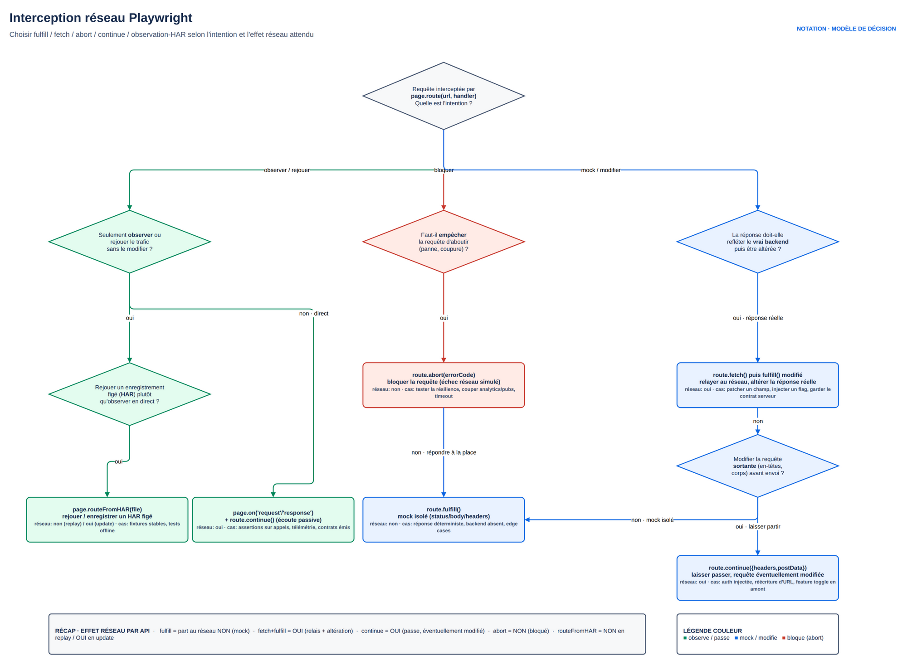

# M4.2 — Mocking et interception réseau

## 1. Cours théorique

### 1.1 Pourquoi intercepter le réseau ?

Un test UI dépend de tout ce que le navigateur charge : API interne, services tiers (cours de change, paiement, cartes), télémétrie, images, polices. Trois besoins :

| Besoin | Exemple | Outil |
|---|---|---|
| **Contrôler** une réponse pour tester un cas rare | Solde négatif, service en panne, liste vide, 500 | `page.route` + `route.fulfill` |
| **Bloquer** ce qui est inutile ou nuisible | Analytics, publicités, images lourdes | `route.abort` |
| **Observer** ce qui se passe | Vérifier qu'un appel a bien eu lieu avec le bon corps, attendre une réponse précise | `page.on('request')`, `page.waitForResponse` |

- Le mocking ne remplace pas les tests contre la vraie API (M4.1).
- Il met l'interface dans un état difficile à produire autrement et isole le test des services externes (règle anti-flaky n°5).

### 1.2 `page.route` : intercepter

```ts
await page.route(url, handler);
```

- `url` : chaîne exacte, **glob** (`'**/api/rates'`, `'**/*.png'`), regex (`/\/api\/accounts\/\d+/`), ou fonction `(url: URL) => boolean`.
- `handler(route, request)` : reçoit la route et la requête. Il **doit** terminer par une des actions ci-dessous, sinon la requête reste en suspens.

| Action | Effet |
|---|---|
| `route.continue()` | Laisse passer (avec options : modifier `headers`, `postData`, `method`, `url`) |
| `route.fulfill({ status, body, json, headers, contentType, path })` | Répond à la place du serveur |
| `route.abort(errorCode?)` | Échec réseau (`'failed'`, `'blockedbyclient'`, `'timedout'`...) |
| `route.fetch(options?)` | Exécute la vraie requête et retourne la réponse, pour la modifier avant `fulfill` |
| `route.fallback()` | Passe au handler suivant (quand plusieurs `route` correspondent) |



*Figure — Interception réseau : choisir le verbe terminal (fulfill · fetch · continue · abort · HAR) selon l'intention et l'effet réseau attendu.*

- Ordre : le **dernier** `page.route` enregistré est consulté en premier.
- `context.route` : toutes les pages du contexte.
- `page.unroute(url)` retire un handler.
- Depuis 1.42, `page.routeFromHAR` rejoue un HAR enregistré (section 1.7).

### 1.3 Mocker entièrement une réponse

```ts
await page.route('**/api/rates', async (route) => {
  await route.fulfill({
    json: { base: 'EUR', date: '2026-01-01', rates: { USD: 2.5 } },   // Content-Type JSON automatique
  });
});
await page.goto('/');
await expect(page.getByText('1 EUR = 2.50 USD')).toBeVisible();
```

Autres formes de `fulfill` : `body: '...'` avec `contentType`, `path: 'fixtures/rates.json'` pour un fichier, `status: 500` pour une erreur.

**Cas d'erreur** : l'usage le plus rentable. API qui tombe, réponse lente, 401 en pleine session, corps mal formé : impossible à déclencher à la demande sur un vrai serveur, trivial avec `fulfill`.

```ts
await page.route('**/api/rates', (route) => route.fulfill({ status: 503, json: { detail: 'Service indisponible' } }));
await expect(page.getByRole('alert')).toContainText('Cours indisponibles');
```

- **Latence** : `await new Promise(r => setTimeout(r, 3000))` dans le handler avant `fulfill`.
- Seul délai fixe légitime de la formation : on simule le réseau, on n'attend pas l'application.

### 1.4 Modifier une réponse réelle

Réponse grosse ou variable : la récupérer et ne changer que ce qui compte, plutôt que la réécrire.

```ts
await page.route('**/api/accounts', async (route) => {
  const response = await route.fetch();            // vraie requête vers le serveur
  const accounts = await response.json();
  accounts[0].balance = -250.75;                   // on force un découvert
  await route.fulfill({ response, json: accounts }); // même statut et en-têtes, corps modifié
});
```

- `fulfill({ response, ... })` réutilise statut et en-têtes de la vraie réponse.
- Modifier la **requête** : `route.continue({ postData, headers })`, pour injecter un en-tête ou altérer un montant envoyé.

### 1.5 Bloquer : `route.abort`

```ts
// Télémétrie et tiers : plus rapide et zéro effet de bord
await context.route(/analytics|hotjar|googletagmanager/, (route) => route.abort());

// Images : tests plus rapides quand le visuel n'est pas le sujet
await page.route('**/*.{png,jpg,jpeg,webp,svg}', (route) => route.abort());

// Par type de ressource
await page.route('**/*', (route) =>
  ['image', 'font', 'media'].includes(route.request().resourceType()) ? route.abort() : route.continue(),
);
```

- Un `fetch` abandonné lève une erreur côté application : vérifier qu'elle la gère (la télémétrie de la mini-banque ignore ses erreurs).
- Bloquer les images : déconseillé pour les tests visuels (M6.1).
- Un blocage global (télémétrie) ne justifie pas une fixture : un `test.beforeEach` dans le fichier concerné, ou un helper explicite appelé en première ligne de chaque test, suffit et reste visible :

```ts
// test.beforeEach dans un fichier de tests
test.beforeEach(async ({ page }) => {
  await page.route('**/api/analytics/**', (route) => route.abort());
});

// ou un helper explicite, appelé par les tests qui en ont besoin
export async function bloquerTelemetrie(page: Page) {
  await page.route('**/api/analytics/**', (route) => route.abort());
}
```

### 1.6 Observer : événements et attentes

```ts
// Journal de tout ce qui part
page.on('request', (req) => console.log('>>', req.method(), req.url()));
page.on('response', (res) => console.log('<<', res.status(), res.url()));
page.on('requestfailed', (req) => console.log('xx', req.url(), req.failure()?.errorText));

// Vérifier qu'un appel a eu lieu avec le bon corps : enregistrer AVANT l'action
const posted = page.waitForRequest((req) => req.url().includes('/api/transfers') && req.method() === 'POST');
await page.getByRole('button', { name: 'Valider le virement' }).click();
const req = await posted;
expect(req.postDataJSON()).toMatchObject({ amount: 20 });

// Attendre une réponse précise plutôt qu'un état visuel
const done = page.waitForResponse((res) => res.url().includes('/api/accounts') && res.ok());
await page.reload();
const accounts = await (await done).json();
```

- `waitForRequest` / `waitForResponse` s'enregistrent **avant** l'action déclenchante (même logique que `waitForEvent('dialog')`, M2.1).
- `page.on` est global au test : `page.off` pour retirer, ou collecter dans un tableau et vérifier à la fin.

### 1.7 Enregistrer et rejouer : HAR

Pour isoler complètement un test d'une API externe : enregistrer le trafic une fois, puis le rejouer.

```ts
// Enregistrement (une fois, en local)
await page.routeFromHAR('fixtures/rates.har', { url: '**/api/rates', update: true });
// Rejeu (en CI, aucune requête réelle vers **/api/rates)
await page.routeFromHAR('fixtures/rates.har', { url: '**/api/rates' });
```

- `npx playwright open --save-har=trafic.har --save-har-glob="**/api/**" http://localhost:5173` enregistre depuis un navigateur manuel.
- HAR à committer, à régénérer quand l'API change.
- Utile pour des tiers payants ou instables ; à éviter pour sa propre API (préférer la vraie, M4.1).

Les options qui font la différence en pratique :

| Option | Effet |
|---|---|
| `url` | Glob des requêtes concernées. **Toujours le renseigner** : sans lui, tout le trafic est rejoué, y compris les scripts et les images, et le moindre changement de bundle casse le test |
| `update: true` | Mode enregistrement : les vraies requêtes partent et le HAR est réécrit. À lancer à la demande, jamais en CI |
| `notFound` | `'abort'` (défaut) : une requête absente du HAR est bloquée — c'est ce qu'on veut, l'échec est explicite. `'fallback'` laisse passer vers le vrai serveur |
| `updateMode: 'minimal'` | N'enregistre que ce qui est nécessaire au rejeu : HAR beaucoup plus petit et lisible en revue de PR |
| `updateContent: 'attach'` | Sort les corps de réponse dans des fichiers séparés à côté du HAR, au lieu de les encoder en base64 dans le JSON |

Deux pièges :

- Un HAR enregistré avec un jeton d'authentification **contient ce jeton** : le relire avant de committer (J5 M8.1, scan de secrets).
- Un HAR n'est pas une spécification : l'API évolue, le test reste vert sur des données périmées.
- Règle : régénération datée, jamais de HAR pour sa propre API.

Seul point du module sans code exécutable dans `demo/` : illustré en direct sur la mini-banque avec la commande d'enregistrement ci-dessus.

### 1.8 Mocker ou ne pas mocker ?

| Situation | Décision |
|---|---|
| Sa propre API, cas nominal | Vraie API (données via `/api/dev/reset` ou création par API) |
| Sa propre API, cas d'erreur (500, timeout, 401 en cours de session) | Mock |
| Service tiers (cours, paiement, SMS) | Mock ou HAR, toujours |
| Télémétrie, pubs, chat | `abort` |
| Test de contrat API | Jamais de mock (M4.1) |
| Données massives (1 000 lignes) pour tester la pagination | Mock avec données générées (M5) |

Un test entièrement mocké vérifie le front seul : il ne détecte pas un changement d'API. La suite combine les deux.

### 1.9 Bonnes pratiques

1. Mocker au plus près : `page.route` dans le test concerné, pas dans une fixture globale (sauf `abort` de télémétrie).
2. Globs précis (`**/api/rates`) plutôt que `**/*` avec des `if`.
3. Toujours terminer un handler par `fulfill`, `continue`, `abort` ou `fallback`.
4. Après un mock d'erreur, vérifier le **message affiché à l'utilisateur**, pas seulement l'absence de crash.
5. Réponses mockées dans `fixtures/` ou `data/` en JSON, typées comme les vraies (M4.1).
6. Nommer les tests par le cas simulé : « affiche une erreur quand le service de cours renvoie 503 ».
7. Ne pas mocker ce que l'on teste : un test de virement avec `/api/transfers` mocké ne teste plus le virement.

### 1.10 Erreurs fréquentes

| Erreur | Symptôme | Correction |
|---|---|---|
| `page.route` après `page.goto` | La première requête n'est pas interceptée | Router avant de naviguer |
| Handler sans `fulfill`/`continue` | La page attend indéfiniment, timeout | Terminer le handler |
| Glob `/api/rates` sans `**/` | Ne matche pas l'URL absolue | `'**/api/rates'` |
| `fulfill({ body: { ... } })` avec un objet | Body doit être string/Buffer | `json: { ... }` |
| `waitForResponse` après le clic | Réponse déjà passée, timeout | Enregistrer avant, `await` après |
| Mock d'un tiers sans tester la vraie intégration ailleurs | Régression non détectée | Test de contrat ou HAR mis à jour |
| `abort` sur une requête dont l'appli ne gère pas l'échec | `Unhandled rejection` dans la console | Écouter `page.on('pageerror', ...)` dans le test (ou un `beforeEach` local) et vérifier qu'aucune erreur n'est levée |

### 1.11 Points à retenir

- `route.fulfill` pour contrôler, `route.fetch` + `fulfill` pour modifier, `route.abort` pour bloquer.
- `page.on`, `waitForRequest`, `waitForResponse` pour observer ; enregistrer avant l'action.
- Mocker les cas d'erreur et les tiers ; ne jamais mocker ce que l'on teste.
- HAR pour isoler un tiers, avec régénération planifiée.

---

## 2. Démonstration

**Objectif** : sur la **mini-banque** (fil rouge), les quatre gestes : mocker entièrement `/api/rates` ; simuler une panne 503 et vérifier le message ; modifier une réponse réelle de `/api/accounts` pour afficher un découvert ; bloquer la télémétrie et prouver qu'elle n'est plus envoyée ; observer le `POST /api/transfers` réel.

**Prérequis** : `docker compose up -d` dans `fil-rouge/`. Projet de démo autonome (`demo/`), sur http://localhost:5173 ; il réutilise le login de `helpers.ts` du J1.

### Étapes

1. Ouvrir le tableau de bord ; onglet Réseau des DevTools : `/api/rates`, `/api/accounts` et `POST /api/analytics/event`.
2. Test 1 : `route.fulfill` sur `**/api/rates`, taux USD à 2.50. L'écran affiche « 1 EUR = 2.50 USD » alors que l'API dit 1.08.
3. Test 2 : `fulfill({ status: 503 })` ; le tableau de bord affiche l'alerte « Cours indisponibles ». Sans mock, ce chemin de code n'est jamais testé.
4. Test 3 : `route.fetch()` sur `/api/accounts`, premier solde à -250,75, vérifier l'affichage. Le composant shadow DOM passe au rouge : pas de `toHaveCSS`. On vérifie le montant ; la couleur relève du test visuel (M6.1).
5. Test 4 : collecter les requêtes vers `/api/analytics` avec `page.on('request')`, sans blocage : 1 requête au chargement. Avec `route.abort()` : la requête part du navigateur (comptée) mais échoue, vu par `page.on('requestfailed')`. `abort` ne supprime pas l'appel côté app : il l'empêche d'atteindre le serveur.
6. Test 5 : `waitForRequest` sur le `POST /api/transfers` réel, lire `postDataJSON()`, puis `waitForResponse` et vérifier `new_balance`.

### Code complet

Voir `demo/tests/mocking.spec.ts`. Extraits :

```ts
test('affiche une erreur quand le service de cours renvoie 503', async ({ page }) => {
  await page.route('**/api/rates', (route) =>
    route.fulfill({ status: 503, json: { detail: 'Fournisseur de cours en maintenance' } }),
  );
  await login(page);
  await expect(page.getByRole('alert')).toContainText('Cours indisponibles');
  await expect(page.getByRole('alert')).toContainText('maintenance');
});

test('un solde négatif venu de la vraie API est affiché en découvert', async ({ page }) => {
  await page.route('**/api/accounts', async (route) => {
    const response = await route.fetch();
    const accounts = await response.json();
    accounts[0].balance = -250.75;
    await route.fulfill({ response, json: accounts });
  });
  await login(page);
  await expect(page.getByTestId('account-row').first()).toContainText(/-250,75\s?€/);
});
```

### Explication du code

- Le `route` est posé **avant** `login(page)` : le `goto` du login puis la navigation vers `/` déclenchent les appels.
- `json:` sérialise et pose `Content-Type: application/json` ; le front lit `detail` dans le corps d'erreur, comme pour une vraie erreur FastAPI.
- `fulfill({ response, json })` conserve le statut 200 et les en-têtes CORS de la vraie réponse. Pas indispensable pour CORS (Playwright répond au niveau du navigateur, avant CORS), mais cela évite de reconstruire les en-têtes.
- Télémétrie : on compte `request` et `requestfailed` ; le premier prouve que l'application émet, le second que le blocage agit.

### Résultat attendu

- 5 tests verts en une dizaine de secondes.
- Trace du test 3, onglet Network : `/api/accounts` avec la mention « mocked » et le corps modifié.

---

## 3. Exercice (30 minutes)

Voir `exercice.md`.

## 4. Correction

Voir `correction/`.

## 5. Contribution au projet fil rouge

**Ce qui change dans l'application** (déjà livré pour la démo) :

- `GET /api/rates` : fournisseur externe simulé, affiché sur le tableau de bord avec message d'erreur si indisponible.
- `POST /api/analytics/event` : télémétrie envoyée par le front sur chaque page.
- Page Bénéficiaires (M4.1).

**Tests Playwright du fil rouge** (séance fil rouge) :

- Helper `preparerPage(page, backend, fake)` dans `support/connexion.ts` : blocage de `/api/analytics/**`, appelé par chaque helper de connexion (`commeRole`, etc.), pas par une fixture.
- Un test « le tableau de bord signale l'indisponibilité des cours » avec `fulfill 503`.
- Un test bonus de latence sur `/api/rates` vérifiant l'affichage « Chargement des cours… ».

**Lien avec la notion** :

- Télémétrie : cas typique d'`abort` global, posé une fois pour toutes dans un helper explicite plutôt que répété dans chaque test.
- Service de cours : cas typique de tiers à mocker.
- Virement : testé contre la vraie API, on ne mocke pas ce que l'on teste.

## Ressources externes

- Mock APIs : https://playwright.dev/docs/mock
- Network : https://playwright.dev/docs/network
- Classe Route : https://playwright.dev/docs/api/class-route
- Classe Request / Response : https://playwright.dev/docs/api/class-request
- HAR : https://playwright.dev/docs/mock#mocking-with-har-files
- Practice Software Testing (exercice) : https://practicesoftwaretesting.com et son API https://api.practicesoftwaretesting.com/api/documentation
