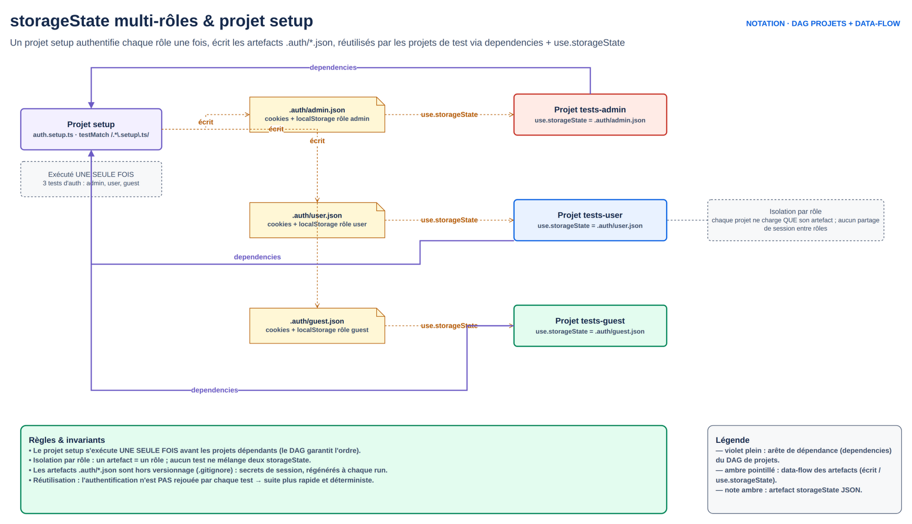

# M5.2 — Faker, isolation des tests et storageState multi-rôles

## 1. Cours théorique

### 1.1 Données synthétiques avec Faker

Deux défauts des jeux de données fixes :

- Collision quand deux tests créent la même chose.
- Une seule forme de donnée : jamais d'apostrophe, d'accent, d'e-mail long.

**Faker** génère des données réalistes et variées.

```powershell
npm i -D @faker-js/faker
```

```ts
import { faker } from '@faker-js/faker/locale/fr';   // locale fr : noms, villes, IBAN FR

const client = {
  prenom: faker.person.firstName(),                 // « Élodie »
  nom: faker.person.lastName(),                     // « Le Gall »
  email: faker.internet.email(),                    // « elodie.legall@example.net »
  iban: faker.finance.iban({ countryCode: 'FR' }),  // IBAN FR valide (clé de contrôle correcte)
  montant: faker.number.float({ min: 1, max: 500, fractionDigits: 2 }),
  libelle: faker.lorem.words(3),
  date: faker.date.recent({ days: 30 }),
  telephone: faker.phone.number(),
};
```

Modules utiles : `person`, `internet`, `finance` (iban, bic, amount, creditCardNumber), `location` (adresse), `date`, `number`, `string` (`alphanumeric`, `uuid`), `helpers` (`arrayElement`, `shuffle` ; `unique` retiré : gérer l'unicité soi-même), `company`, `commerce`.

**Reproductibilité** : un échec aléatoire est difficile à rejouer. Deux réponses :

1. **Graine** : `faker.seed(42)` en tête de fichier rend la séquence déterministe. Mêmes données à chaque exécution. Recommandé en CI.
2. **Annotation** : `test.info().annotations.push({ type: 'données', description: JSON.stringify(client) })` journalise la donnée générée dans le rapport. Même sans graine, on sait ce qui a été utilisé.

En formation : graine fixe par fichier, plus annotation. Pour varier les formes : une graine par jour (`faker.seed(Number(new Date().toISOString().slice(0, 10).replace(/-/g, '')))`), l'annotation permettant de rejouer.

**Fabriques (factories)** : une fonction par entité, avec surcharges.

```ts
// utils/factories.ts
export const unBeneficiaire = (surcharges: Partial<Beneficiaire> = {}): Beneficiaire => ({
  name: faker.person.fullName(),
  iban: faker.finance.iban({ countryCode: 'FR', formatted: true }),
  ...surcharges,
});
// unBeneficiaire()                       -> aléatoire
// unBeneficiaire({ iban: 'DE89...' })    -> cas d'erreur contrôlé
```

Les fabriques vivent dans `utils/` ; tests, fixtures et faux backend les utilisent.

### 1.2 Les 3 stratégies d'isolation

Règle anti-flaky n°2 : un test ne dépend d'aucun autre. Quand les tests modifient des données partagées (base, API), trois stratégies, de la plus simple à la plus robuste :

| Stratégie | Principe | Quand | Coût |
|---|---|---|---|
| **1. Reset global** | Remettre la base à un état connu avant la suite (ou avant chaque test, en série) | Petite suite, environnement dédié, exécution séquentielle | Interdit le parallélisme, ou impose `workers: 1` |
| **2. Données uniques par test** | Chaque test crée ce dont il a besoin avec des identifiants uniques (Faker, `Date.now()`, `testInfo.testId`), et le nettoie lui-même à la fin | Suite parallèle sur une base partagée | Du code de préparation ; la base grossit si le nettoyage échoue |

- Mini-banque J2 : mélange fragile (reset partiel + choix manuel de Bob/Alice).
- Une troisième stratégie existe pour les grandes suites très parallélisées : un espace de données (utilisateur, tenant) créé une fois par worker et réutilisé par tous ses tests. Elle est vue en pratique dans le fil rouge du Jour 3 (`utilisateurWorker` / `commeUtilisateurWorker`), pas ici.

Critères de choix :

- **Création d'utilisateur par l'API possible ?** Oui : données uniques par test (voire un espace par worker, cf. fil rouge J3). Non : un pool d'utilisateurs préexistants distribué par worker (`users[testInfo.parallelIndex % users.length]`, borné par `workers`).
- **Nettoyage fiable ?** Non : données préfixées (`qa-<runId>-...`) et nettoyage global périodique.
- **Transaction possible ?** Certaines équipes enveloppent chaque test dans une transaction annulée : hors périmètre Playwright, à voir avec les développeurs.

### 1.3 `storageState` : une authentification durable

- Connexion par l'interface dans chaque test : 2 à 5 secondes et des points de fragilité en plus.
- Playwright **sauvegarde l'état du navigateur** (cookies, localStorage, IndexedDB depuis 1.51) dans un fichier JSON et le **réinjecte** dans un contexte neuf.

```ts
await page.context().storageState({ path: '.auth/alice.json' });   // sauvegarde
// puis, pour un test :
test.use({ storageState: '.auth/alice.json' });                     // injection
```

Motif recommandé par la documentation : un **projet de setup** qui se connecte une fois, des projets de tests qui en **dépendent**.

```ts
// playwright.config.ts
projects: [
  { name: 'setup', testMatch: /.*\.setup\.ts/ },
  {
    name: 'chromium',
    use: { ...devices['Desktop Chrome'], storageState: '.auth/alice.json' },
    dependencies: ['setup'],
  },
]
```

```ts
// tests/auth.setup.ts
import { test as setup, expect } from '@playwright/test';

setup('authentifier Alice', async ({ page }) => {
  await page.goto('/login');
  // ... connexion complète, MFA compris ...
  await expect(page.getByRole('heading', { name: /Bonjour/ })).toBeVisible();
  await page.context().storageState({ path: '.auth/alice.json' });
});
```

Ce qui se passe :

- `setup` tourne d'abord, une fois par run (pas par worker), et écrit le fichier.
- Chaque test `chromium` démarre dans un contexte neuf, cookies et localStorage remplis : le premier `goto` arrive connecté.

Points d'attention :

- `.auth/` dans `.gitignore` : le fichier contient des jetons.
- Jeton expiré : rare, le setup se rejoue à chaque run. Longue suite : prévoir un jeton de test à durée étendue.
- Setup **par l'API** (plus rapide, plus robuste) : login, injection du jeton dans localStorage (`page.evaluate` ou `context.addInitScript`), sauvegarde. Choisir selon ce que l'application lit : cookie ou localStorage.
- `storageState` capture un instant : l'état en mémoire (Redux non persisté) n'est pas restauré. Une application bien faite le recharge à partir du jeton.



*Figure — storageState multi-rôles : centraliser l'authentification dans un projet setup, isoler la session de chaque rôle et ne jamais rejouer le login.*

### 1.4 Multi-rôles

Trois façons de gérer plusieurs rôles (client / conseiller, lecteur / éditeur / administrateur) :

**a. Un fichier par rôle, choisi par test ou par `describe`** (le plus courant) :

```ts
// tests/auth.setup.ts : un setup par rôle (ou une boucle)
for (const role of ['alice', 'carol'] as const) {
  setup(`authentifier ${role}`, async ({ page }) => { ...; await page.context().storageState({ path: `.auth/${role}.json` }); });
}

// tests/conseiller.spec.ts
test.use({ storageState: '.auth/carol.json' });
test('un conseiller voit tous les comptes', async ({ page }) => { ... });
```

**b. Deux rôles dans le même test** (un client agit, un conseiller vérifie) : second contexte créé à la main.

```ts
test('le conseiller voit le virement du client', async ({ browser, page /* alice */ }) => {
  // page est connectée en Alice via storageState du projet
  await effectuerVirement(page);

  const contexteCarol = await browser.newContext({ storageState: '.auth/carol.json' });
  const pageCarol = await contexteCarol.newPage();
  await pageCarol.goto('/');
  await expect(pageCarol.getByTestId('account-row').filter({ hasText: 'Alice' })).toContainText(...);
  await contexteCarol.close();
});
```

Ou une fonction assistante qui ouvre ce contexte explicitement (fermeture en fin de fonction).

**Multi-rôles et parallélisme** :

- `.auth/*.json` : écrits une fois par run, lus par tous les workers.
- Un rôle par worker (un utilisateur créé et connecté une fois par worker plutôt que par un projet setup) est utile pour les grandes suites très parallélisées ; ce n'est pas nécessaire ici, c'est vu en pratique dans le fil rouge du Jour 3.

### 1.5 Tests qui doivent être non connectés

`storageState` au niveau du projet : **tous** les tests démarrent connectés. Les tests de login ou de déconnexion le désactivent :

```ts
test.use({ storageState: { cookies: [], origins: [] } });
```

Fichier dédié, cette ligne en tête.

### 1.6 Bonnes pratiques

1. Faker avec graine et annotation ; fabriques dans `utils/factories.ts` ; locale `fr` pour les IBAN et noms.
2. Stratégie d'isolation explicite, documentée dans le README des tests.
3. `storageState` par projet de setup ; `.auth/` ignoré ; setup par API quand c'est possible.
4. Un fichier par rôle ; `test.use({ storageState })` par fichier, jamais au milieu d'un fichier.
5. Les tests d'authentification désactivent le `storageState`.
6. Jamais d'objet Faker muté partagé entre tests ; chaque test génère ses données au début.
7. Première assertion du test : l'utilisateur connecté est affiché (l'état restauré est reconnu).

### 1.7 Erreurs fréquentes

| Erreur | Symptôme | Correction |
|---|---|---|
| `faker.seed()` oublié, échec non reproductible | « ça a échoué une fois avec un nom bizarre » | Graine + annotation |
| Faker génère un e-mail déjà utilisé | 409 sur la création | Suffixe unique (`Date.now()`, `testId`) |
| `storageState` chargé mais l'appli redirige vers login | L'appli lit un cookie que le setup n'a pas obtenu, ou jeton expiré, ou mauvais domaine (`localhost` vs `127.0.0.1`) | Vérifier le fichier JSON ; même `baseURL` partout |
| Setup exécuté dans chaque worker | Setup écrit comme fixture worker au lieu de projet | Projet `setup` + `dependencies` |
| Test de login vert mais faux | Il démarre déjà connecté | `test.use({ storageState: { cookies: [], origins: [] } })` |
| `.auth/alice.json` committé | Jeton dans git | `.gitignore` |
| Deux tests créent « Bob Durand » | Doublon refusé | Fabrique avec Faker |

### 1.8 Points à retenir

- Faker : réaliste, varié, reproductible avec une graine, tracé par annotation ; fabriques.
- Isolation : reset global ou données uniques par test (fabriques Faker). Choisir et documenter.
- `storageState` : projet setup + `dependencies`, un fichier par rôle, désactivé pour les tests de login.
- Deux rôles dans un test : second contexte ou fixture dédiée.

---

## 2. Démonstration

**Objectif** : sur SauceDemo, un projet `setup` qui sauvegarde l'état connecté de `standard_user` et `visual_user`, des tests qui démarrent connectés, un test à deux rôles, un test de login sans storageState, et un formulaire de commande rempli avec Faker (graine + annotation).

**Site** : https://www.saucedemo.com. La session est un cookie `session-username`, capturé par `storageState`.

### Étapes

1. Config : projets `setup`, `standard` (storageState standard) et `visual` (storageState visual_user), `dependencies: ['setup']`.
2. `tests/auth.setup.ts` : boucle sur les deux rôles, connexion, assertion, `storageState({ path })`. `npx playwright test --project=setup`, puis le cookie dans `.auth/standard.json`.
3. `tests/catalogue.spec.ts` : `page.goto('/inventory.html')` arrive directement sur le catalogue. `--project=standard` puis `--project=visual` : même test, deux sessions.
4. `tests/deux-roles.spec.ts` : `standard_user` ajoute un article ; un second contexte `visual_user` a un panier vide (panier par session). `browser.newContext({ storageState })` et `close()`.
5. `tests/login.spec.ts` : `test.use({ storageState: { cookies: [], origins: [] } })` puis un test de mauvais mot de passe. Sans cette ligne, le test échoue (déjà connecté, redirigé).
6. `tests/commande-faker.spec.ts` : `faker.seed(2026)`, fabrique `unClient()`, remplissage du formulaire, annotation. Deux exécutions : mêmes données. Autre graine : autres données, toujours valides.

### Code complet

Voir `demo/`. Extraits :

```ts
// playwright.config.ts
projects: [
  { name: 'setup', testMatch: /.*\.setup\.ts/ },
  { name: 'standard', use: { ...devices['Desktop Chrome'], storageState: '.auth/standard.json' }, dependencies: ['setup'] },
  { name: 'visual', use: { ...devices['Desktop Chrome'], storageState: '.auth/visual.json' }, dependencies: ['setup'] },
],
```

```ts
// tests/auth.setup.ts
const ROLES = { standard: 'standard_user', visual: 'visual_user' } as const;
for (const [role, user] of Object.entries(ROLES)) {
  setup(`authentifier ${role}`, async ({ page }) => {
    await page.goto('/');
    await page.getByPlaceholder('Username').fill(user);
    await page.getByPlaceholder('Password').fill('secret_sauce');
    await page.getByRole('button', { name: 'Login' }).click();
    await expect(page).toHaveURL(/inventory/);
    await page.context().storageState({ path: `.auth/${role}.json` });
  });
}
```

### Explication du code

- Le projet `setup` n'a pas de `storageState` : il part vierge. Les projets de tests en dépendent : lancés après, et seulement si le setup réussit.
- Deux fichiers pour deux rôles ; un test peut en choisir un autre avec `test.use`.
- Le test deux-rôles crée son second contexte et le ferme : une ressource se libère.
- `unClient()` avec Faker produit prénom, nom, code postal ; la graine fixe rend le test rejouable.

### Résultat attendu

`--project=setup` : 2 tests, fichiers créés. `--project=standard` : tous les tests verts, sans étape de login dans les traces. Le test de login échoue si on retire la ligne `test.use`.

---

## 3. Exercice (35 minutes)

Voir `exercice.md`.

## 4. Correction

Voir `correction/`.

## 5. Contribution au projet fil rouge

**Ce qui change dans les tests de la mini-banque** (séance fil rouge) :

- `tests/auth.setup.ts` : connexion **par l'API** (login + MFA) pour Alice, Bob et Carol, jeton injecté dans `localStorage`, sauvegarde dans `.auth/<rôle>.json`.
- Une fonction assistante (`commeRole`) ouvre un contexte avec le bon `storageState` pour Alice, Bob ou Carol, sans écran de login.
- Les tests d'authentification désactivent le `storageState`.
- `utils/factories.ts` avec Faker (locale fr, graine) : `unBeneficiaire()`, `unVirement()`.
- Isolation : un espace par worker. `POST /api/dev/users` crée un client de test avec un compte et un solde donnés (réservé à l'environnement de formation).
- Une fonction assistante (`commeUtilisateurWorker`) : un utilisateur créé une fois par worker et réutilisé par tous ses tests. Les tests de virement et de bénéficiaires travaillent dans cet espace : plus de choix manuel entre Alice et Bob, plus de reset.
- Rôle **conseiller** (Carol) : un test vérifie qu'elle voit les comptes de tous les clients.

**Ce qui change dans l'application** : endpoints `POST /api/dev/users` et `DELETE /api/dev/users/{id}` ; page conseiller minimale (tableau de tous les comptes avec le nom du client).

**Lien avec la notion** : `storageState` à la place de la connexion par l'écran divise le temps de la suite UI par deux ; l'espace par worker supprime les dernières dépendances entre tests.

## Ressources externes

- Authentification : https://playwright.dev/docs/auth
- Faker : https://fakerjs.dev/guide/
- Faker locale fr et IBAN : https://fakerjs.dev/api/finance.html#iban
- Isolation : https://playwright.dev/docs/browser-contexts
- Projets et dépendances : https://playwright.dev/docs/test-projects#dependencies
- Parallélisme (`parallelIndex`) : https://playwright.dev/docs/test-parallel
