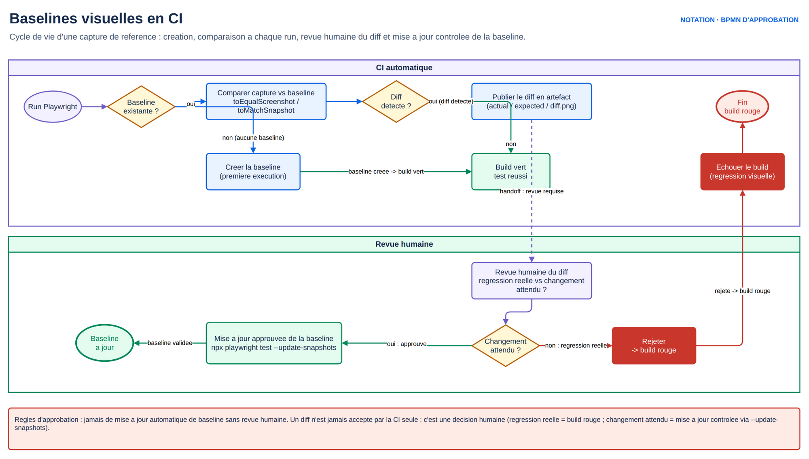

# M6.1 — Tests visuels et non-régression visuelle

## 1. Cours théorique

### 1.1 Ce qu'un test fonctionnel ne voit pas

- Un bouton présent, activé, avec le bon texte passe le test fonctionnel, même blanc sur fond blanc, hors écran ou chevauchant un autre élément : seule une **comparaison d'images** (ou un humain) le voit.
- Test visuel : capture de l'interface comparée à une **image de référence** (baseline) validée. Différence de pixels au-delà d'un seuil = échec, avec image de diff.

Détecte : régressions CSS, polices manquantes, icônes cassées, mise en page mobile, thème sombre, composants de design system.

Ne détecte pas : le sens (un mauvais montant bien affiché passe). Complément, pas remplacement.

### 1.2 `toHaveScreenshot` et les baselines

```ts
await expect(page).toHaveScreenshot();                          // page entière visible (viewport)
await expect(page).toHaveScreenshot('tableau-de-bord.png');     // nom explicite
await expect(page.getByTestId('recap')).toHaveScreenshot();     // un élément
await expect(page).toHaveScreenshot({ fullPage: true });
```

Fonctionnement :

1. **Première exécution** : pas de baseline. Playwright enregistre la capture dans `tests/<fichier>.spec.ts-snapshots/<nom>-<projet>-<plateforme>.png` et **fait échouer** le test (« A snapshot doesn't exist at ..., writing actual »). Voulu : une baseline doit être validée par un humain avant de servir.
2. **Exécutions suivantes** : comparaison avec la référence, échec si différence > seuil. Trois images dans le rapport : attendue, obtenue, diff.
3. **Mise à jour volontaire** : `npx playwright test --update-snapshots` (ou `-u`) réécrit les baselines. Après vérification du diff, jamais en réflexe.

Stabilité intégrée : plusieurs captures jusqu'à deux identiques consécutives (animations terminées) ; animations CSS désactivées (`animations: 'disabled'`) ; curseur masqué (`caret: 'hide'`).

### 1.3 Nommage et plateformes

- Nom par défaut = **projet** + **plateforme** (`linux`, `win32`, `darwin`).
- Le rendu des polices diffère selon le système : une baseline Windows ne correspond pas à une capture Linux.

```
tests/dashboard.spec.ts-snapshots/
├── tableau-de-bord-chromium-win32.png    # poste Windows
└── tableau-de-bord-chromium-linux.png    # CI
```

Conséquences :

- **Générer les baselines là où les tests tournent.** CI Linux : générer en CI ou dans le conteneur Docker Playwright, identique à la CI (J5). Raison n°1 d'exécuter le visuel dans Docker.
- Chemin personnalisé : `snapshotPathTemplate: '{testDir}/__screenshots__/{projectName}/{platform}/{testFilePath}/{arg}{ext}'` dans la config, pour regrouper par projet.
- Multi-navigateurs : une baseline par projet (`chromium`, `firefox`, `webkit`) ; on ne compare jamais Firefox à Chromium. En pratique : visuel sur un navigateur et une ou deux tailles d'écran, fonctionnel multi-navigateurs.

### 1.4 Seuils : `threshold`, `maxDiffPixels`, `maxDiffPixelRatio`

Comparaison par défaut avec l'algorithme `pixelmatch` :

| Option | Signification | Défaut | Usage |
|---|---|---|---|
| `threshold` | Tolérance de **couleur** par pixel, entre 0 (identique) et 1 (tout passe) | 0.2 | Anti-aliasing, légères variations de rendu |
| `maxDiffPixels` | Nombre de pixels différents **autorisés** | 0 | Une zone connue qui varie (horloge) |
| `maxDiffPixelRatio` | Proportion de pixels différents autorisés (0 à 1) | 0 | Même chose, relatif à la taille |

```ts
await expect(page).toHaveScreenshot({ maxDiffPixels: 100 });
await expect(page).toHaveScreenshot({ maxDiffPixelRatio: 0.01, threshold: 0.3 });
```

Valeurs globales dans la config : `expect: { toHaveScreenshot: { maxDiffPixels: 50, threshold: 0.2 } }`.

Discipline : un seuil absorbe le bruit de rendu, pas une régression. Partir de 0, monter au minimum nécessaire ; **masque** plutôt que seuil si la variation est localisée.

### 1.5 Masquer les zones dynamiques

Date, heure, avatar aléatoire, publicité, compteur, données Faker changent à chaque exécution. Trois techniques, de la plus propre à la moins :

```ts
// 1. mask : rectangle uni (rose par défaut) sur les locators donnés
await expect(page).toHaveScreenshot({ mask: [page.getByTestId('horloge'), page.getByRole('img', { name: 'avatar' })], maskColor: '#000' });

// 2. Figer la donnée : horloge Playwright (M2.2), graine Faker, mock d'API (M4.2)
await page.clock.setFixedTime(new Date('2026-01-15T10:00:00'));

// 3. stylePath : injecter un CSS qui cache ou neutralise (visibility: hidden sur .pub)
await expect(page).toHaveScreenshot({ stylePath: 'tests/visuel.css' });
```

- Le masque s'applique **à l'identique** sur la baseline et la capture : pixels masqués jamais comparés.
- Figer la donnée quand c'est possible (le rendu reste vérifié), masquer sinon.

Autres causes d'instabilité :

- **Viewport** : fixé dans la config, jamais `maximize`.
- **Polices web** : attendre `document.fonts.ready` ou un élément qui utilise la police.
- **Images lazy** : scroller ou attendre `toBeVisible` sur la dernière image.
- **Barres de défilement** : masquées par Playwright en headless Chromium.
- **Hover** : souris déplacée en `(0,0)` avant la capture.

### 1.6 Que capturer ?

| Cible | Quand |
|---|---|
| Composant (`locator.toHaveScreenshot`) | Design system, widget, carte : le plus stable, le plus précis |
| Écran visible (`page`) | Pages clés : tableau de bord, formulaires principaux |
| Page entière (`fullPage: true`) | Pages longues, rarement (lourd, sensible au contenu) |

Échantillonnage : quelques écrans critiques, pas toutes les pages. Un test par écran principal et par composant partagé attrape la majorité des régressions CSS.

### 1.7 Workflow de mise à jour des baselines en CI

Un échec visuel en CI est une régression ou un changement voulu. Processus :



*Figure — Baselines visuelles en CI : distinguer une régression réelle (build rouge) d'un changement attendu, sous revue humaine.*

1. La CI publie le rapport avec les trois images (J5 : artefact du pipeline).
2. Un humain compare. Régression : corriger le code. Changement voulu : mettre à jour la baseline.
3. Mise à jour **dans l'environnement de la CI** : job manuel de CI qui lance `--update-snapshots` et committe les PNG (ou les pousse sur la branche de la PR), ou conteneur Docker Playwright en local.
4. Nouvelles baselines dans la PR, revues comme du code (PNG visibles dans la revue de PR Azure DevOps).

Options utiles :

- `--update-snapshots=missing` : écrit seulement les baselines absentes.
- `--ignore-snapshots` : ignore les assertions visuelles, pour un run rapide.
- `--update-snapshots=changed` (depuis 1.49) : met à jour seulement celles qui diffèrent.

Stockage : PNG dans git (petits), Git LFS pour de gros volumes.

### 1.8 `toMatchSnapshot` : la comparaison de texte et de fichiers

- Même mécanisme pour du non-image : `expect(await page.textContent('body')).toMatchSnapshot('page.txt')`, un PDF, un CSV exporté. Fige le contenu exact d'un export.
- `toMatchAriaSnapshot` (1.49) compare l'**arbre d'accessibilité** en YAML : structure sans pixels, très stable, complémentaire du visuel et de M6.2.

```ts
await expect(page.getByRole('navigation')).toMatchAriaSnapshot(`
  - navigation "Navigation principale":
    - link "Tableau de bord"
    - link "Virement"
    - link "Bénéficiaires"
`);
```

### 1.9 Bonnes pratiques

1. Viewport fixe, projet visuel dédié (chromium, 1280x720), tests tagués `@visual` pour les lancer à part.
2. Composants d'abord, écrans clés ensuite, page entière rarement.
3. Zéro seuil au départ ; masque ou donnée figée avant seuil.
4. Baselines générées dans l'environnement d'exécution (Docker = CI) et revues en PR.
5. Une baseline par navigateur et par plateforme, jamais partagée.
6. Captures nommées : `tableau-de-bord.png`, pas `test-1.png`.
7. État stable avant la capture : dernière donnée affichée, polices chargées.

### 1.10 Erreurs fréquentes

| Erreur | Symptôme | Correction |
|---|---|---|
| Premier run rouge « snapshot doesn't exist » | Normal | Vérifier la baseline générée, relancer |
| Baseline Windows commitée, CI Linux rouge | Rendu des polices | Générer en Docker |
| Diff de 3 pixels sur un bord | Anti-aliasing | `threshold` léger ou `maxDiffPixels: 10` |
| Diff sur la date | Zone dynamique | `mask` ou `clock` |
| `--update-snapshots` lancé pour « faire passer » | Régression validée par erreur | Revue du diff obligatoire |
| Capture avec le menu survolé | Souris restée sur un élément | `page.mouse.move(0, 0)` |
| Baseline différente entre deux postes | Plateforme, viewport, zoom | Même config, Docker |
| Page entière tronquée | Contenu chargé en lazy | Attendre le dernier élément |

### 1.11 Points à retenir

- `toHaveScreenshot` : baseline générée au premier run, validée par un humain, mise à jour avec `-u` après revue.
- Nom = projet + plateforme ; générer là où les tests tournent (Docker).
- `threshold` pour la couleur, `maxDiffPixels` pour la quantité ; masque ou donnée figée d'abord.
- Composants et écrans clés ; `toMatchAriaSnapshot` pour la structure.

---

## 2. Démonstration

**Objectif** : sur SauceDemo, baseline du catalogue, régression visuelle par injection CSS, lecture du diff, masque, seuil, capture d'un composant et arbre ARIA.

**Site** : https://www.saucedemo.com

### Étapes

1. Config : projet `visuel`, viewport 1280x720, `snapshotPathTemplate` par projet et plateforme, `expect.toHaveScreenshot` sans tolérance.
2. Test 1 : capture du catalogue (`page`), connecté via `storageState` (M5.2). Premier run : échec « writing actual ». Second run : vert.
3. Test 2 : même page, `page.addStyleTag({ content: '.inventory_item_price { color: red }' })` avant la capture, **même nom de baseline** : échec ; rapport attendue / obtenue / diff. Injection retirée ensuite.
4. Test 3 : composant (carte « Sauce Labs Backpack ») : fichier petit, insensible au reste de la page.
5. Test 4 : `visual_user` (SauceDemo décale volontairement des éléments pour cet utilisateur) : la capture du test 1 échoue. `maxDiffPixels: 100` ne suffit pas ; un seuil ne « règle » pas ce cas.
6. Test 5 : badge du panier masqué après un ajout : capture stable quel que soit le nombre d'articles.
7. Test 6 : `toMatchAriaSnapshot` sur l'en-tête : structure sans pixels.

### Code complet

Voir `demo/`. Extraits :

```ts
test('le catalogue correspond à la baseline', { tag: '@visual' }, async ({ page }) => {
  await page.goto('/inventory.html');
  await expect(page.getByTestId('inventory-item')).toHaveCount(6);   // état stable avant capture
  await page.mouse.move(0, 0);
  await expect(page).toHaveScreenshot('catalogue.png');
});

test('carte produit : composant isolé', { tag: '@visual' }, async ({ page }) => {
  await page.goto('/inventory.html');
  const carte = page.getByTestId('inventory-item').filter({ hasText: 'Sauce Labs Backpack' });
  await expect(carte).toHaveScreenshot('carte-backpack.png');
});

test('badge masqué : capture indépendante du contenu du panier', { tag: '@visual' }, async ({ page }) => {
  await page.goto('/inventory.html');
  await page.getByTestId('inventory-item').first().getByRole('button', { name: 'Add to cart' }).click();
  await expect(page.getByTestId('shopping-cart-badge')).toHaveText('1');
  await expect(page.getByTestId('header-container')).toHaveScreenshot('entete.png', {
    mask: [page.getByTestId('shopping-cart-badge')],
  });
});
```

### Explication du code

- `toHaveCount(6)` avant la capture : catalogue rendu ; une capture pendant le chargement donnerait une baseline fausse.
- `page.mouse.move(0, 0)` : pas d'état hover.
- Masque sur le badge : en-tête indépendant du panier.
- Tag `@visual` : `--grep @visual` ou `--grep-invert @visual` selon le besoin.

### Résultat attendu

- Premier run : baselines créées, tests visuels en échec « writing actual », test de régression sauté (il refuse de créer une baseline avec le CSS injecté).
- Second run : tout vert ; les deux `test.fail()` (régression CSS, `visual_user`) comptent comme échecs attendus. Le rapport du test 2 montre le diff en rouge sur les prix.

---

## 3. Exercice (30 minutes)

Voir `exercice.md`.

## 4. Correction

Voir `correction/`.

## 5. Contribution au projet fil rouge

**Ce qui change dans les tests de la mini-banque** (séance fil rouge) :

- Projet `visuel` (chromium, 1280x720, `snapshotPathTemplate` par projet et plateforme).
- `tests/visuel/dashboard.spec.ts` : baseline du **tableau de bord** d'Alice avec date des opérations figée (`page.clock`) et cours de change mockés (données fixes) ; baseline du composant `<bank-balance>` ; `toMatchAriaSnapshot` de la navigation.
- Baselines générées dans le conteneur Playwright (J5) ; en attendant, vous générez les vôtres localement et les ignorez dans git.

**Ce qui change dans l'application** : rien de fonctionnel. Les dates d'opérations sont calculées côté serveur relativement à aujourd'hui : le test fixe la date **des données** via le mock d'API plutôt que l'horloge (les opérations viennent du backend, pas du navigateur).

**Lien avec la notion** : le tableau de bord réunit toutes les sources d'instabilité visuelle (montants, dates, cours, shadow DOM) ; chacune est figée ou masquée.

## Ressources externes

- Comparaisons visuelles : https://playwright.dev/docs/test-snapshots
- `toHaveScreenshot` : https://playwright.dev/docs/api/class-pageassertions#page-assertions-to-have-screenshot-1
- Options globales : https://playwright.dev/docs/test-configuration#expect-options
- Aria snapshots : https://playwright.dev/docs/aria-snapshots
- Docker Playwright : https://playwright.dev/docs/docker
