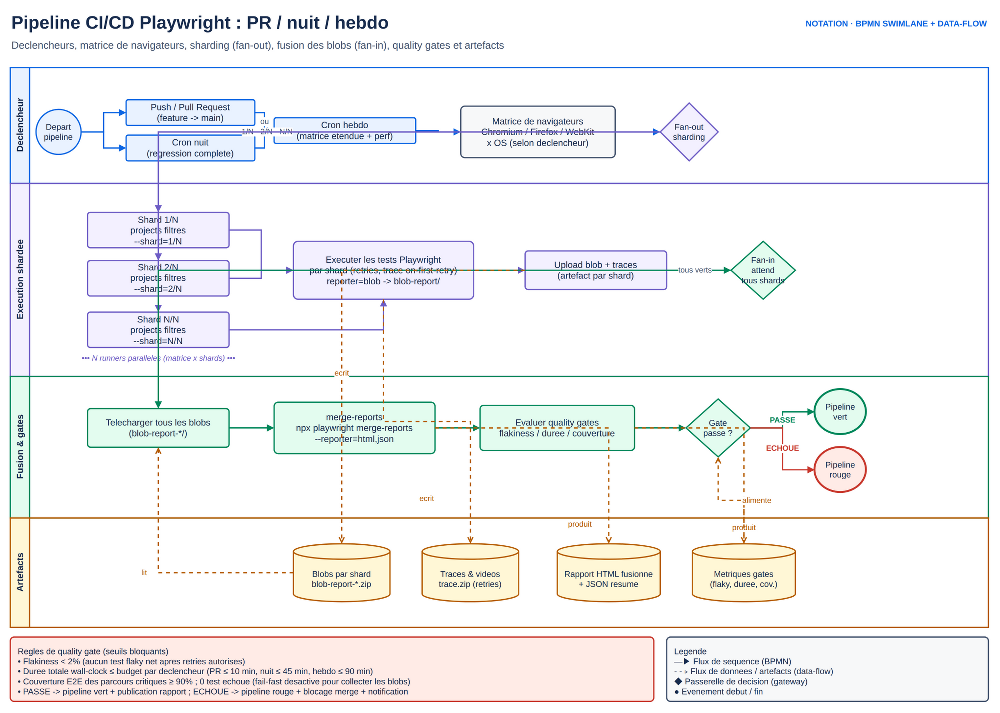

# M9.1 — Pipeline Azure Pipelines YAML de base, avec Docker

## 1. Cours théorique

### 1.1 Ce que fait un pipeline de tests

- Un pipeline exécute la suite à chaque événement (PR, push sur `main`, horaire), sur une machine neuve.
- Il publie les résultats et les artefacts (rapport HTML, traces) et rend un verdict qui bloque ou non la PR.
- Trois propriétés font sa valeur : **reproductible** (même environnement à chaque run : Docker), **rapide** (retour en PR en moins de 10 minutes), **lisible** (échecs visibles sans ouvrir de log).

### 1.2 Anatomie d'`azure-pipelines.yml`

```yaml
trigger:                      # push sur ces branches
  branches: { include: [main] }
  paths: { include: [frontend/*, backend/*, azure-pipelines.yml] }

pr:                           # PR vers ces branches (Azure Repos : la branch policy déclenche ; ce bloc sert pour GitHub)
  branches: { include: [main] }

variables:
  NODE_VERSION: '22.x'
  PLAYWRIGHT_IMAGE: mcr.microsoft.com/playwright:v1.62.1-noble

pool:
  vmImage: ubuntu-latest      # agent hébergé Microsoft ; ou name: <pool auto-hébergé>

stages:
- stage: Verification
  jobs:
  - job: Lint
    steps: [...]
  - job: TestsAPI
    steps: [...]
- stage: TestsUI
  dependsOn: Verification
  jobs:
  - job: Smoke
    container: $[ variables.PLAYWRIGHT_IMAGE ]
    steps: [...]
```

| Niveau | Rôle |
|---|---|
| **stage** | Phase logique (Vérification, Tests, Publication) ; séquentielle par défaut, `dependsOn` et `condition` |
| **job** | Unité d'exécution sur **un agent** ; les jobs d'un stage tournent en parallèle si le parallélisme le permet ; `container:` exécute les steps dans une image Docker |
| **step** | `script:`, `bash:`, `pwsh:`, ou une **task** (`NodeTool@0`, `Cache@2`, `PublishBuildArtifacts@1`, `PublishTestResults@2`, `Docker@2`, `DockerCompose@1`) |
| **template** | Fichier YAML réutilisé (`- template: templates/tests-playwright.yml`) avec paramètres |

- Variables prédéfinies : `$(Build.SourceBranch)`, `$(Build.BuildId)`, `$(System.PullRequest.PullRequestId)`, `$(Pipeline.Workspace)`.
- Variables définies dans le YAML, dans l'interface (secrètes) ou dans des variable groups (M9.2).
- Expressions : `$[ ]` (runtime), `${{ }}` (compilation), `condition: succeededOrFailed()`.

### 1.3 Exécuter Playwright dans Docker : docker compose

- L'agent construit et lance front, back et tests avec `docker-compose.tests.yml`, comme sur le poste du développeur.
- Même commande partout (`npm run test:docker`), résultats via volumes.
- Choix du fil rouge : le pipeline fait ce que fait le testeur.

```yaml
- script: docker compose -f docker-compose.yml -f docker-compose.tests.yml run --rm --build tests
  displayName: Tests Playwright dans Docker
- script: docker compose -f docker-compose.yml -f docker-compose.tests.yml down -v
  condition: always()
```

- La **version de l'image** (dans `Dockerfile.tests`) égale la version de `@playwright/test` (`v1.62.1` ↔ `1.62.1`) ; sinon les navigateurs ne correspondent pas.
- Les baselines visuelles se génèrent dans cette image (M6.1).

**Bonus — job dans un conteneur simple (`container:`), sans compose** : quand il n'y a pas d'application multi-service à démarrer (tests API seuls contre un service déjà en place, ou site public comme l'exercice SauceDemo), l'agent peut exécuter directement les steps dans l'image Playwright, sans docker compose :

```yaml
- job: TestsAPI
  container: mcr.microsoft.com/playwright:v1.62.1-noble
  services:                       # conteneurs de service additionnels si besoin
    backend: { image: $(ACR)/mini-banque-backend:$(Build.BuildId), ports: ['8000:8000'] }
  steps:
  - script: npm ci
  - script: npx playwright test --project=api --project=chromium
```

C'est ce que fait le job `TestsAPI` de la démo (M9.1) et le pipeline de l'exercice SauceDemo : une alternative légère à connaître, pas le chemin principal enseigné. Docker compose reste l'approche de référence dès que plusieurs conteneurs applicatifs sont en jeu (cas du fil rouge).

Docker plutôt que `npx playwright install --with-deps` sur l'agent :

- Environnement identique local/CI.
- Pas de téléchargement de navigateurs à chaque run (image en cache).
- Pas de dépendances système à gérer.
- Pas de surprise de rendu.

### 1.4 Cache

- Sans cache, `npm ci` télécharge tout à chaque run.
- `Cache@2` restaure `node_modules` (ou le cache npm) à partir d'une clé dérivée de `package-lock.json`.

```yaml
- task: Cache@2
  inputs:
    key: 'npm | "$(Agent.OS)" | frontend/package-lock.json'
    restoreKeys: 'npm | "$(Agent.OS)"'
    path: $(npm_config_cache)     # ~/.npm ; ou frontend/node_modules avec cacheHitVar
  displayName: Cache npm
- script: npm ci
  workingDirectory: frontend
```

- Navigateurs (sans image Docker, agent hébergé classique) : cache de `~/.cache/ms-playwright`, clé sur la version de Playwright.
- Avec Docker : cache d'image géré par le runtime, ou `Docker@2` + registre d'entreprise (ACR) pour éviter de reconstruire.

### 1.5 Le pipeline de PR et le pipeline complet

| Pipeline | Déclencheur | Contenu | Cible de durée |
|---|---|---|---|
| **PR** (`azure-pipelines.yml`, attaché à la branch policy) | Chaque mise à jour de PR | lint, `api`, `chromium --grep @smoke` (Docker), publication des résultats | < 10 min |
| **Complet** (même fichier, `main` et planifié) | Push sur `main`, nuit | tous les projets, shards (M9.2), visuel, a11y, rapport complet, KPIs | 20 à 40 min |

Un seul fichier YAML avec des `condition:` sur `Build.Reason` (`PullRequest`, `IndividualCI`, `Schedule`) évite la duplication :

```yaml
- ${{ if eq(variables['Build.Reason'], 'PullRequest') }}:
  - script: npx playwright test --grep @smoke
- ${{ else }}:
  - script: npx playwright test
```



*Figure — Pipeline PR/nuit/hebdo : fan-out par shards, fan-in des blobs, fusion des rapports et décision de qualité bloquante.*

### 1.6 Publier résultats et artefacts

- **Résultats de tests** : reporter `junit` de Playwright (`['junit', { outputFile: 'results/junit.xml' }]`) + `PublishTestResults@2` (`testResultsFormat: JUnit`, `failTaskOnFailedTests: false` car le step de test a déjà échoué).
  - L'onglet **Tests** du run et de la PR liste chaque test, avec historique et détection des tests instables (M10.1).
- **Artefacts** : `PublishPipelineArtifact@1` sur `playwright-report` et `test-results` (traces des échecs), `condition: succeededOrFailed()`.
  - Le rapport HTML se télécharge et s'ouvre en local avec `npx playwright show-report <dossier>`.
- **Rapport HTML visible en ligne** : Azure DevOps ne sert pas de HTML.
  - Options : extension marketplace (« HTML Viewer »), ou publication sur un stockage statique (M10.1).

### 1.7 Bonnes pratiques

1. Un fichier YAML versionné, revu en PR, avec des templates pour ce qui se répète.
2. Docker avec version épinglée égale à celle de Playwright ; même commande en local et en CI.
3. Pipeline de PR court (lint, API, smoke) ; complet sur `main` et la nuit.
4. `npm ci`, jamais `npm install`, en CI ; cache sur `package-lock.json`.
5. Résultats JUnit publiés, artefacts sur échec ; `condition: succeededOrFailed()` sur toute publication.
6. `forbidOnly`, `retries: 2`, `workers` fixés par `CI=1` dans la config (J1) ; `trace: retain-on-failure`.
7. Échec = rouge : pas de `continueOnError` sur le step de test ; le pipeline doit dire la vérité.

### 1.8 Erreurs fréquentes

| Erreur | Symptôme | Correction |
|---|---|---|
| Image `v1.60` avec `@playwright/test` 1.62 | « Executable doesn't exist » ou rendu différent | Versions égales, variable unique |
| `npm install` en CI | Lock ignoré, versions dérivantes | `npm ci` |
| Tests UI qui n'atteignent pas l'application | Timeouts sur `goto` | Nom de service Docker (`http://frontend:5173`), `depends_on` avec healthcheck, `BASE_URL`/`API_URL` en variables |
| `VITE_API_URL=localhost:8000` dans le conteneur | Le navigateur du conteneur `tests` ne voit pas `localhost` du front | `http://backend:8000`, CORS adapté |
| Aucun artefact quand ça échoue | Step de publication sauté | `condition: succeededOrFailed()` |
| Pipeline de PR de 40 minutes | Personne n'attend, policies contournées | Smoke + API en PR, reste la nuit |
| « No hosted parallelism has been purchased or granted » | Nouvelle organisation sans parallélisme | Demande de grant gratuit (délai) ou agent auto-hébergé (M9.2) |
| Baselines visuelles rouges en CI | Générées sur Windows | Générer dans l'image Docker |

### 1.9 Points à retenir

- stages > jobs > steps ; triggers `trigger`/`pr`/`schedules` ; variables et conditions.
- Docker : docker compose comme approche principale (`container:` seul en bonus, sans service additionnel) ; version = Playwright ; même commande partout.
- Cache npm sur le lock ; `npm ci`.
- Publier JUnit et artefacts, toujours ; pipeline de PR court, complet la nuit.

---

## 2. Démonstration

**Objectif** : créer le pipeline de PR de la mini-banque dans Azure Pipelines, l'exécuter, lire les résultats et les artefacts, puis l'attacher à la branch policy `main`.

### Étapes

1. Lire `docker-compose.tests.yml` et `frontend/Dockerfile.tests` ; lancer en local `npm run test:docker` (front, back et tests dans Docker, résultats dans `frontend/test-results`) : la commande que le pipeline exécutera.
2. Écrire `azure-pipelines.yml` (fourni dans `demo/`) : stage `Verification` (lint + `api` en conteneur Playwright avec le backend en conteneur de service) puis stage `TestsUI` (docker compose, smoke en PR, complet sinon), publication JUnit et artefacts. Chaque bloc est commenté.
3. Azure Pipelines > New pipeline > Azure Repos Git > `mini-banque` > Existing YAML file. Run. Si « no hosted parallelism » : lire le message, faire la demande de grant, et basculer sur l'agent auto-hébergé Docker (M9.2, `demo/agent-docker.md`).
4. Lire le run : stages, jobs, durées, onglet Tests (chaque test Playwright listé), artefacts `playwright-report` et `test-results`. Télécharger le rapport, `npx playwright show-report`.
5. Casser un test dans une branche, ouvrir une PR : build rouge dans la PR et dans l'onglet Tests de la PR. Réparer.
6. Branches > `main` > policies > Build validation : ajouter le pipeline, Required, expiration immédiate, filtre de chemins. La PR affiche maintenant « Required check ».

### Fichiers de la démo

`demo/azure-pipelines.yml` (pipeline complet commenté), `demo/templates/tests-playwright.yml` (template de job), `demo/agent-docker.md` (repli auto-hébergé, détaillé en M9.2), `demo/reporter-junit.md` (ligne de config à ajouter).

### Résultat attendu

Run vert en 6 à 9 minutes en PR ; onglet Tests peuplé ; artefacts téléchargeables ; policy active.

---

## 3. Exercice (25 minutes)

Voir `exercice.md`.

## 4. Correction

Voir `correction/`.

## 5. Contribution au projet fil rouge

**Ce qui est ajouté dans `fil-rouge/`** :

- `azure-pipelines.yml`, `templates/tests-playwright.yml`.
- Reporter `junit` dans `playwright.config.ts`.
- `Dockerfile.tests`, `docker-compose.tests.yml`, script `npm run test:docker`.
- Pipeline créé dans chaque organisation et attaché en policy.

**Lien avec la notion** :

- Le pipeline exécute exactement `docker compose ... run tests`.
- La config `CI=1` de J1 (retries, workers, forbidOnly) prend enfin effet.

## Ressources externes

- Schéma YAML Azure Pipelines : https://learn.microsoft.com/azure/devops/pipelines/yaml-schema
- Playwright en CI (Azure Pipelines) : https://playwright.dev/docs/ci#azure-pipelines
- Image Docker Playwright : https://playwright.dev/docs/docker
- Cache@2 : https://learn.microsoft.com/azure/devops/pipelines/release/caching
- Conteneurs de service : https://learn.microsoft.com/azure/devops/pipelines/process/service-containers
- PublishTestResults@2 : https://learn.microsoft.com/azure/devops/pipelines/tasks/reference/publish-test-results-v2
- Parallélisme gratuit : https://learn.microsoft.com/azure/devops/pipelines/licensing/concurrent-jobs
